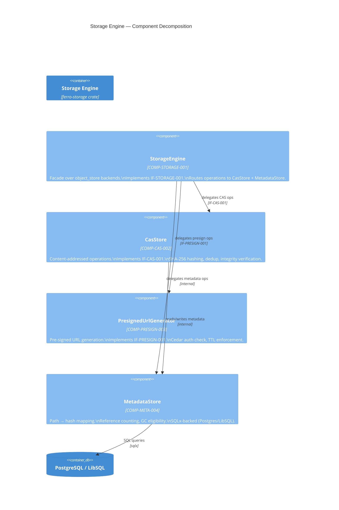
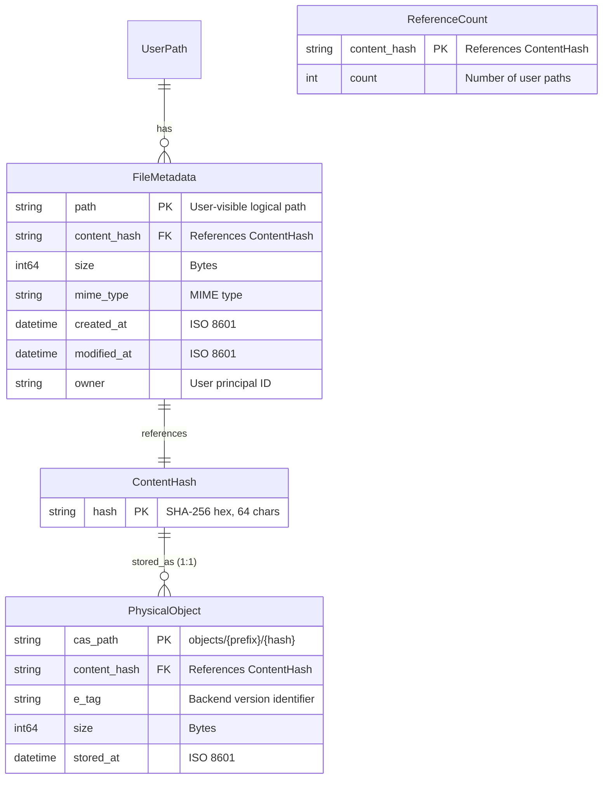
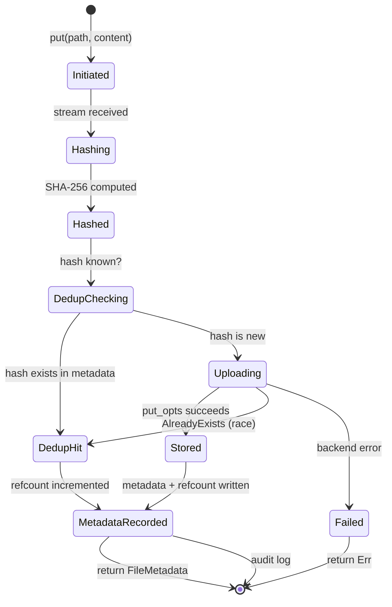
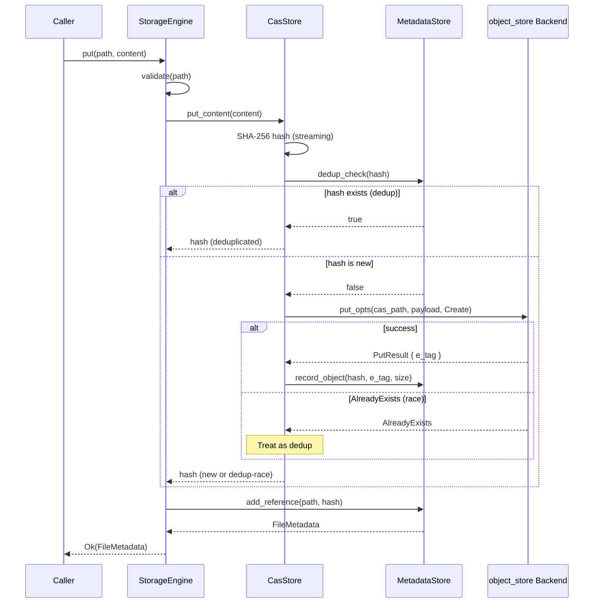
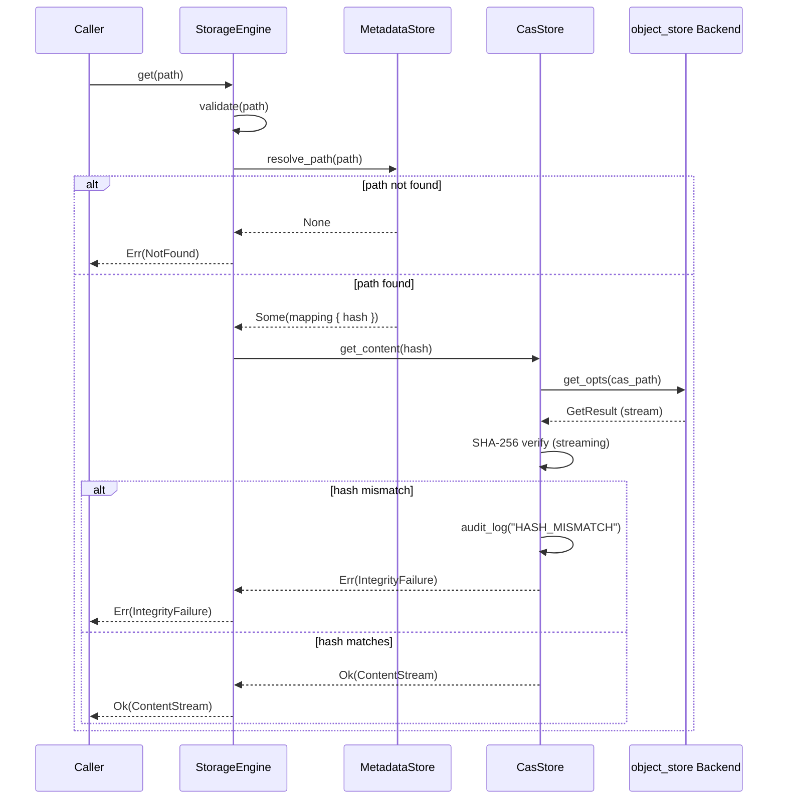

# BP-STORAGE-ENGINE-001: Storage Engine — Architectural Specification (Blue Paper)

| Field        | Value                                      |
|--------------|--------------------------------------------|
| Document ID  | BP-STORAGE-ENGINE-001                      |
| Domain       | Storage Systems                            |
| Version      | 1.0                                        |
| Status       | Draft                                      |
| Author       | Construct (Systems Architect, Phase 2)     |
| Date         | 2026-04-18                                 |
| Supersedes   | YP-STORAGE-CAS-001                         |
| Compliance   | IEEE 1016-2009 (Software Design Descriptions) |

---

## BP-1: Design Overview

### Purpose

The Storage Engine is Ferro's multi-backend content-addressable storage layer. It provides a unified async API for file CRUD operations over Local FS, AWS S3, Google Cloud Storage, and Azure Blob Storage, with SHA-256-based content deduplication, atomic writes, and pre-signed URL generation for direct-to-cloud transfers.

### C4 Context Diagram

```mermaid
C4Context
    title Ferro Storage Engine — System Context

    Person(server_team, "Server Team", "Integrates storage into WebDAV/WOPI/API layers")
    Person(desktop_team, "Desktop Team", "Consumes storage via rclone WebDAV mount")
    Person(devops, "DevOps", "Deploys and configures storage backends")

    System(ferro_server, "Ferro Server", "Axum HTTP server\nWebDAV/WOPI/API")

    Container(storage_engine, "Storage Engine", "Rust crate: ferro-storage\nMulti-backend CAS facade", "COMP-STORAGE-001")

    ContainerDb(metadata_db, "Metadata Store", "PostgreSQL / LibSQL\nPath → Hash mapping\nReference counting", "COMP-META-004")

    External_Ext(cloud_s3, "AWS S3", "Object storage")
    External_Ext(cloud_gcs, "Google Cloud Storage", "Object storage")
    External_Ext(cloud_azure, "Azure Blob Storage", "Object storage")
    External_Ext(local_fs, "Local Filesystem", "POSIX file storage")
    External_Ext(in_memory, "In-Memory", "Testing backend")

    Rel(ferro_server, storage_engine, "uses", "IF-STORAGE-001")
    Rel(storage_engine, metadata_db, "reads/writes metadata", "sqlx")
    Rel(storage_engine, cloud_s3, "PUT/GET/DELETE", "object_store (aws)")
    Rel(storage_engine, cloud_gcs, "PUT/GET/DELETE", "object_store (gcp)")
    Rel(storage_engine, cloud_azure, "PUT/GET/DELETE", "object_store (azure)")
    Rel(storage_engine, local_fs, "PUT/GET/DELETE", "object_store (fs)")
    Rel(storage_engine, in_memory, "PUT/GET/DELETE", "object_store (memory)")
```

### Stakeholders

| Stakeholder   | Role                                          | Concerns                                |
|---------------|-----------------------------------------------|-----------------------------------------|
| Server Team   | Integrates storage into WebDAV/WOPI/API       | API ergonomics, async performance       |
| Desktop Team  | Consumes storage via rclone WebDAV mount      | Compatibility, latency                  |
| DevOps        | Deploys and configures storage backends       | Operational simplicity, observability   |

---

## BP-2: Design Decomposition

### Component Hierarchy (C4Component)



### Component Specifications

| ID              | Name                     | Responsibility                                          | Interface        |
|-----------------|--------------------------|---------------------------------------------------------|------------------|
| COMP-STORAGE-001 | StorageEngine           | Facade: routes user-path operations to CAS + metadata    | IF-STORAGE-001   |
| COMP-CAS-002     | CasStore                | Content-addressed put/get/dedup with integrity checks    | IF-CAS-001       |
| COMP-PRESIGN-003 | PresignedUrlGenerator   | Auth-gated pre-signed URL generation                    | IF-PRESIGN-001   |
| COMP-META-004    | MetadataStore           | Path→hash mapping, reference counting, GC tracking      | Internal         |

### Dependencies

| Dependency   | Version   | Purpose                                  | Coupling Type  |
|--------------|-----------|------------------------------------------|----------------|
| `object_store` | >=0.13.0 | Unified multi-backend object store API | Afferent (required) |
| `sha2`       | latest    | SHA-256 hash computation (RustCrypto)    | Afferent (required) |
| `sqlx`       | latest    | Async PostgreSQL/LibSQL driver            | Afferent (required) |
| `tokio`      | latest    | Async runtime                             | Afferent (required) |
| `bytes`      | latest    | Byte buffer types                        | Afferent (required) |
| `url`        | latest    | URL type for pre-signed URLs             | Afferent (required) |
| `uuid`       | latest    | Staging path UUID generation             | Afferent (required) |
| `thiserror`  | latest    | Error type derivation                    | Afferent (required) |
| `tracing`    | latest    | Structured logging                       | Afferent (required) |

### Coupling Metrics

| Coupling Dimension  | Value  | Rationale                                       |
|---------------------|--------|--------------------------------------------------|
| Afferent Coupling   | High   | All upper layers depend on StorageEngine trait    |
| Efferent Coupling   | Low    | Depends only on `object_store`, `sha2`, `sqlx`   |
| Instability         | Low    | Stable interface, abstracted behind traits       |
| Abstractness        | High   | All public APIs exposed as traits                |
| Distance from Main  | Low    | Near ideal: traits + implementations             |

---

## BP-3: Design Rationale

### DR-001: Why `object_store` Over Custom S3/GCS/Azure Clients

| Criterion           | `object_store` (chosen)      | Custom per-backend client          |
|---------------------|------------------------------|------------------------------------|
| Backend count       | 5+ backends, single API      | N separate implementations         |
| Maintenance burden  | Apache Arrow governance      | Must track each SDK independently |
| Multipart upload    | Built-in, uniform            | Reimplement per backend            |
| Atomic put modes    | `PutMode::Create/Update`     | Backend-specific conditional ops  |
| Pre-signed URLs     | `Signer` trait               | Reimplement signing per backend    |
| Ecosystem           | Used by Apache Iceberg, Delta Lake, DataFusion | N/A |
| Testing             | `InMemory` backend for unit tests | Mock per backend               |

**Decision:** `object_store` provides a battle-tested, production-grade abstraction used by major data lake projects. The uniform API eliminates per-backend code paths, and the `InMemory` backend enables zero-infrastructure unit testing.

### DR-002: Why SHA-256 Over Other Hash Functions

| Algorithm  | Output Bits | Collision Resistance | Speed (single-thread) | Industry Adoption |
|------------|-------------|---------------------|-----------------------|-------------------|
| SHA-256    | 256         | 2^128 (birthday)    | ~500 MB/s             | FIPS 180-4, ubiquitous |
| SHA-3-256  | 256         | 2^128               | ~300 MB/s             | FIPS 202, less common |
| BLAKE3     | 256         | 2^128               | ~2 GB/s               | Not FIPS-approved  |
| SHA-1      | 160         | BROKEN (SHAttered)  | N/A                   | Deprecated        |

**Decision:** SHA-256 is FIPS 180-4 approved, provides 2^128 collision resistance, meets the >= 500 MB/s throughput requirement (DC-HASH-001), and is implemented in the audited `sha2` (RustCrypto) crate. BLAKE3 is faster but not FIPS-approved, which is a compliance risk for enterprise deployments. See THM-SHA256-001 in YP-STORAGE-CAS-001.

### DR-003: Why Separate Metadata Store From Content Store

1. **Instant Snapshots** (REQ-ENT-003): Metadata rollback restores the file tree to any point-in-time state without moving physical data.
2. **Cross-Account Dedup** (REQ-STOR-003): Multiple user paths can reference the same content hash. The metadata store tracks per-user ownership and reference counts.
3. **GDPR Erasure** (GDPR Art. 17): Deleting a user's copy decrements the reference count; physical data is only removed when the last reference is deleted.
4. **Garbage Collection**: Reference counting in the metadata store identifies orphaned physical objects eligible for cleanup.
5. **Ransomware Protection**: Rolling back metadata undoes ransomware mutations without data movement.

### ADR-001: Use `object_store` for Storage Abstraction

```
ADR-001: Use object_store crate for multi-backend storage abstraction
Status: Accepted
Context: Ferro requires storage over S3, GCS, Azure, Local FS.
Decision: Use Apache Arrow's object_store crate (v0.13.2+).
Consequences:
  + Uniform async API across all backends
  + Built-in atomic put modes (Create, Overwrite, Update)
  + Built-in multipart upload
  + Signer trait for pre-signed URLs
  + InMemory backend for testing
  + Governed by Apache Arrow project (MIT/Apache-2.0)
  - Adds dependency on object_store crate
  - Pre-signed URLs not available for Local FS or InMemory
  - Conditional put (Update/ETag) not available on InMemory
```

---

## BP-4: Traceability

### Requirements Traceability

| Requirement      | Blue Paper Section                         | Components              | Verification            |
|------------------|--------------------------------------------|-------------------------|-------------------------|
| REQ-STOR-001     | BP-2 (COMP-STORAGE-001), BP-5 (IF-STORAGE-001) | StorageEngine         | Integration test per backend |
| REQ-STOR-002     | BP-2 (COMP-CAS-002), BP-5 (IF-CAS-001)     | CasStore               | TV-CAS-003, TV-CAS-004  |
| REQ-STOR-003     | BP-6 (Metadata data model, ref counting)   | MetadataStore          | TV-CAS-016              |
| REQ-STOR-004     | BP-2 (COMP-PRESIGN-003), BP-5 (IF-PRESIGN-001) | PresignedUrlGenerator | TV-CAS-007 to TV-CAS-012 |
| REQ-STOR-005     | BP-7 (State machine), BP-9 (PROP-CAS-003) | StorageEngine, CasStore | TV-CAS-014              |
| REQ-STOR-006     | BP-7 (Concurrent put flow)                 | CasStore               | TV-CAS-013              |

### Yellow Paper Traceability

| Yellow Paper Element           | Blue Paper Section                         |
|--------------------------------|--------------------------------------------|
| DEF-CAS-001 (CAS formal def)   | BP-6 (Data Design), BP-9 (Formal Verification) |
| THM-SHA256-001 (SHA-256 security) | BP-3 (DR-002: Why SHA-256)             |
| THM-DEDUP-001 (Dedup correctness) | BP-9 (PROP-CAS-001)                      |
| DEF-PRESIGNED-001 (Pre-signed URL) | BP-5 (IF-PRESIGN-001)                   |
| DEF-ATOMIC-001 (Atomic writes)  | BP-7 (State machine), BP-9 (PROP-CAS-003)  |
| ALG-CAS-PUT-001 (Put algorithm) | BP-7 (Sequence diagram: put)               |
| ALG-CAS-GET-001 (Get algorithm) | BP-7 (Sequence diagram: get)               |
| ALG-PRESIGN-001 (Presign algorithm) | BP-5 (IF-PRESIGN-001 operations)        |
| DC-HASH-001                     | BP-6 (ContentHash validation)              |
| DC-STORAGE-001                  | BP-5 (StorageEngine error handling)        |
| DC-PRESIGN-001                  | BP-5 (PresignedUrlGenerator preconditions) |
| DC-DEDUP-001                    | BP-5 (CasStore dedup_check)                |
| DC-INTEGRITY-001                | BP-5 (CasStore get_content postcondition)  |
| DC-BACKEND-001                  | BP-8 (Backend configuration)               |
| DC-LATENCY-001                  | BP-8 (Resource requirements)               |

### Test Vector Traceability

| Test Vector   | Property Verified          | Blue Paper Section   |
|---------------|----------------------------|----------------------|
| TV-CAS-001    | Normal put/get roundtrip   | BP-5 (IF-CAS-001)    |
| TV-CAS-002    | Empty content handling     | BP-5 (IF-CAS-001)    |
| TV-CAS-003    | Dedup across paths         | BP-9 (PROP-CAS-001)  |
| TV-CAS-004    | Same content overwrite     | BP-9 (PROP-CAS-001)  |
| TV-CAS-005    | Corruption detection       | BP-9 (PROP-CAS-002)  |
| TV-CAS-006    | Multipart upload           | BP-7 (State machine) |
| TV-CAS-007–010 | Presigned URL flows       | BP-5 (IF-PRESIGN-001)|
| TV-CAS-011    | Unauthorized presign deny  | BP-5 (PRE-PRESIGN-003)|
| TV-CAS-012    | TTL clamping               | BP-5 (PRE-PRESIGN-004)|
| TV-CAS-013    | Concurrent put dedup race  | BP-9 (PROP-CAS-001)  |
| TV-CAS-014    | Atomicity under concurrent get/put | BP-9 (PROP-CAS-003) |
| TV-CAS-015    | Cross-backend equivalence  | BP-2 (object_store)   |
| TV-CAS-016    | GC on zero references      | BP-6 (Metadata model)  |
| TV-CAS-017    | Binary content roundtrip   | BP-5 (IF-CAS-001)    |
| TV-CAS-018    | Path traversal prevention  | BP-5 (PRE-STORAGE-001)|
| TV-CAS-019–020 | NIST SHA-256 vectors      | BP-9 (PROP-CAS-002)  |

---

## BP-5: Interface Design

### IF-STORAGE-001: StorageEngine Trait

```rust
#[async_trait]
pub trait StorageEngine: Send + Sync + Debug + 'static {
    async fn put(&self, path: &UserPath, content: PutPayload) -> Result<FileMetadata>;
    async fn get(&self, path: &UserPath) -> Result<ContentStream>;
    async fn delete(&self, path: &UserPath) -> Result<()>;
    async fn list(&self, prefix: Option<&UserPath>) -> Result<Vec<ObjectMeta>>;
    async fn copy(&self, src: &UserPath, dst: &UserPath) -> Result<()>;
    async fn move_path(&self, src: &UserPath, dst: &UserPath) -> Result<()>;
    async fn head(&self, path: &UserPath) -> Result<ObjectMeta>;
}
```

#### Operation: `put`

| Aspect         | Specification                                                                 |
|----------------|-------------------------------------------------------------------------------|
| Preconditions  | PRE-STORAGE-001: `path` must be a valid, normalized UserPath (no `..` traversal) |
|                | PRE-STORAGE-002: `content` must not exceed 5 TB (DC-STORAGE-001)               |
| Postconditions | POST-STORAGE-001: `MetadataStore` contains a mapping from `path` to the content hash |
|                | POST-STORAGE-002: Physical object at CAS path contains the exact bytes of `content` |
|                | POST-STORAGE-003: If hash already existed, only metadata is updated (dedup)    |
| Invariants     | INV-STORAGE-001: Every user path maps to exactly one content hash at any time  |
|                | INV-STORAGE-002: Reference count >= 1 for all stored hashes                    |
| Error Handling | ERR-STORAGE-001: `InvalidPath` — path contains traversal or invalid characters |
|                | ERR-STORAGE-002: `ObjectTooLarge` — content exceeds max object size            |
|                | ERR-STORAGE-003: `BackendError` — object_store returned an error               |
|                | ERR-STORAGE-004: `MetadataError` — metadata DB operation failed                |
| Complexity     | Time: O(n) where n = content size; Space: O(n) buffered for atomic put        |
| Thread Safety  | Safe: concurrent puts to different paths; serializable via PutMode::Create for same hash |

#### Operation: `get`

| Aspect         | Specification                                                                 |
|----------------|-------------------------------------------------------------------------------|
| Preconditions  | PRE-STORAGE-001: `path` must be a valid, normalized UserPath                   |
| Postconditions | POST-STORAGE-004: Returned bytes satisfy `SHA-256(bytes) == stored_hash` (integrity) |
| Invariants     | INV-STORAGE-001: Mapping unchanged by read                                    |
| Error Handling | ERR-STORAGE-005: `NotFound` — no metadata mapping for `path`                  |
|                | ERR-STORAGE-006: `IntegrityFailure` — SHA-256 mismatch on fetched content      |
|                | ERR-STORAGE-007: `BackendError` — object_store returned an error              |
| Complexity     | Time: O(1) metadata + O(n) fetch + O(n) verification; Space: O(n)            |
| Thread Safety  | Safe: concurrent reads to any path                                           |

#### Operation: `delete`

| Aspect         | Specification                                                                 |
|----------------|-------------------------------------------------------------------------------|
| Preconditions  | PRE-STORAGE-001: `path` must be a valid, normalized UserPath                   |
| Postconditions | POST-STORAGE-005: Metadata mapping for `path` is removed                      |
|                | POST-STORAGE-006: Reference count for content hash is decremented             |
|                | POST-STORAGE-007: If ref count reaches 0, physical object marked for GC       |
| Invariants     | INV-STORAGE-001: Deleted path no longer maps to any hash                      |
| Error Handling | ERR-STORAGE-005: `NotFound` — no metadata mapping for `path`                  |
|                | ERR-STORAGE-004: `MetadataError` — metadata DB operation failed               |
| Complexity     | Time: O(1) metadata; Space: O(1)                                             |
| Thread Safety  | Safe: concurrent deletes to different paths; last-delete triggers GC mark     |

#### Operation: `list`

| Aspect         | Specification                                                                 |
|----------------|-------------------------------------------------------------------------------|
| Preconditions  | PRE-STORAGE-003: `prefix` must be a valid path prefix (may be None for all)   |
| Postconditions | POST-STORAGE-008: Returns all ObjectMeta entries matching the prefix         |
| Invariants     | List is a snapshot; concurrent modifications may not be reflected             |
| Error Handling | ERR-STORAGE-003: `BackendError` — object_store returned an error              |
| Complexity     | Time: O(k) where k = number of matching objects; Space: O(k)                  |
| Thread Safety  | Safe: concurrent with other operations                                       |

#### Operation: `copy`

| Aspect         | Specification                                                                 |
|----------------|-------------------------------------------------------------------------------|
| Preconditions  | PRE-STORAGE-001: `src` and `dst` must be valid, normalized UserPaths          |
|                | PRE-STORAGE-004: `src` must exist in metadata                                |
| Postconditions | POST-STORAGE-009: `dst` maps to the same content hash as `src`              |
|                | POST-STORAGE-010: Reference count for the shared hash is incremented         |
| Invariants     | INV-STORAGE-001: Both paths now map to the same hash                          |
| Error Handling | ERR-STORAGE-005: `NotFound` — `src` not found                                |
|                | ERR-STORAGE-003: `BackendError` — backend copy failed                         |
| Complexity     | Time: O(1) metadata (no physical copy needed for CAS); Space: O(1)           |
| Thread Safety  | Safe: concurrent with other operations                                       |

#### Operation: `move_path`

| Aspect         | Specification                                                                 |
|----------------|-------------------------------------------------------------------------------|
| Preconditions  | PRE-STORAGE-001: `src` and `dst` must be valid, normalized UserPaths          |
|                | PRE-STORAGE-004: `src` must exist in metadata                                |
| Postconditions | POST-STORAGE-011: `src` mapping removed, `dst` mapping created with same hash |
|                | POST-STORAGE-012: Reference count unchanged (path transfer, not content change)|
| Invariants     | INV-STORAGE-001: `dst` now maps to the hash; `src` no longer maps             |
| Error Handling | ERR-STORAGE-005: `NotFound` — `src` not found                                |
|                | ERR-STORAGE-004: `MetadataError` — metadata DB operation failed               |
| Complexity     | Time: O(1) metadata; Space: O(1)                                             |
| Thread Safety  | Safe: serializable via metadata DB transaction                                |

#### Operation: `head`

| Aspect         | Specification                                                                 |
|----------------|-------------------------------------------------------------------------------|
| Preconditions  | PRE-STORAGE-001: `path` must be a valid, normalized UserPath                   |
| Postconditions | POST-STORAGE-013: Returns ObjectMeta with size, last_modified, e_tag          |
| Invariants     | INV-STORAGE-001: Metadata unchanged                                           |
| Error Handling | ERR-STORAGE-005: `NotFound` — no metadata mapping for `path`                  |
| Complexity     | Time: O(1); Space: O(1)                                                       |
| Thread Safety  | Safe: concurrent reads                                                        |

---

### IF-CAS-001: CasStore Trait

```rust
#[async_trait]
pub trait CasStore: Send + Sync + Debug + 'static {
    async fn put_content(&self, content: PutPayload) -> Result<ContentHash>;
    async fn get_content(&self, hash: &ContentHash) -> Result<ContentStream>;
    async fn exists(&self, hash: &ContentHash) -> Result<bool>;
    async fn dedup_check(&self, hash: &ContentHash) -> Result<bool>;
}
```

#### Operation: `put_content`

| Aspect         | Specification                                                                 |
|----------------|-------------------------------------------------------------------------------|
| Preconditions  | PRE-CAS-001: `content` must not exceed 5 TB (DC-STORAGE-001)                 |
| Postconditions | POST-CAS-001: Content stored at CAS path `objects/{prefix}/{hash}`           |
|                | POST-CAS-002: Returns `ContentHash` = SHA-256 hex of content                  |
|                | POST-CAS-003: If hash already existed, returns existing hash (no double store)|
| Invariants     | INV-CAS-001: At most one physical copy exists per unique hash                |
|                | INV-CAS-002: `SHA-256(physical_bytes) == hash` always holds                  |
| Error Handling | ERR-CAS-001: `ObjectTooLarge` — content exceeds max object size              |
|                | ERR-CAS-002: `HashComputeError` — hashing failed                              |
|                | ERR-CAS-003: `BackendError` — object_store put failed                         |
| Complexity     | Time: O(n) hash + O(n) upload; Space: O(n) buffered for atomic put           |
| Thread Safety  | Safe: concurrent puts with same hash resolved via PutMode::Create + AlreadyExists fallback (DC-DEDUP-001) |

#### Operation: `get_content`

| Aspect         | Specification                                                                 |
|----------------|-------------------------------------------------------------------------------|
| Preconditions  | PRE-CAS-002: `hash` must be a valid 64-character hex string                   |
| Postconditions | POST-CAS-004: Returned bytes satisfy `SHA-256(bytes) == hash` (DC-INTEGRITY-001)|
| Invariants     | INV-CAS-002: Physical bytes unchanged by read                                |
| Error Handling | ERR-CAS-004: `NotFound` — no physical object for hash                         |
|                | ERR-CAS-005: `IntegrityFailure` — SHA-256 mismatch (audit logged)            |
|                | ERR-CAS-003: `BackendError` — object_store get failed                         |
| Complexity     | Time: O(n) fetch + O(n) verification; Space: O(n)                             |
| Thread Safety  | Safe: concurrent reads                                                        |

#### Operation: `exists`

| Aspect         | Specification                                                                 |
|----------------|-------------------------------------------------------------------------------|
| Preconditions  | PRE-CAS-002: `hash` must be a valid 64-character hex string                   |
| Postconditions | POST-CAS-005: Returns `true` iff physical object exists at CAS path           |
| Invariants     | No state change                                                               |
| Error Handling | ERR-CAS-003: `BackendError` — object_store head failed                        |
| Complexity     | Time: O(1); Space: O(1)                                                       |
| Thread Safety  | Safe: concurrent reads                                                        |

#### Operation: `dedup_check`

| Aspect         | Specification                                                                 |
|----------------|-------------------------------------------------------------------------------|
| Preconditions  | PRE-CAS-002: `hash` must be a valid 64-character hex string                   |
| Postconditions | POST-CAS-006: Returns `true` iff hash exists in both metadata DB and physical store |
| Invariants     | No state change                                                               |
| Error Handling | ERR-CAS-004: `NotFound` — hash not in metadata                                |
|                | ERR-CAS-003: `BackendError` — backend check failed                            |
| Complexity     | Time: O(1) metadata + O(1) head; Space: O(1)                                  |
| Thread Safety  | Safe: concurrent reads                                                        |

---

### IF-PRESIGN-001: PresignedUrlGenerator Trait

```rust
#[async_trait]
pub trait PresignedUrlGenerator: Send + Sync + Debug + 'static {
    async fn generate_put_url(&self, path: &UserPath, expires: Duration) -> Result<Url>;
    async fn generate_get_url(&self, path: &UserPath, expires: Duration) -> Result<Url>;
}
```

#### Operation: `generate_put_url`

| Aspect         | Specification                                                                 |
|----------------|-------------------------------------------------------------------------------|
| Preconditions  | PRE-PRESIGN-001: Caller must be authorized via Cedar policy (`FileWrite` action) |
|                | PRE-PRESIGN-002: `path` must be a valid, normalized UserPath                   |
|                | PRE-PRESIGN-003: Backend must implement `Signer` trait (S3/GCS/Azure only)    |
| Postconditions | POST-PRESIGN-001: Returns a URL valid for PUT to a UUID-namespaced staging path |
|                | POST-PRESIGN-002: URL expires within `clamped(expires, 1s, 3600s)` (DC-PRESIGN-001) |
|                | POST-PRESIGN-003: Audit log entry created for URL generation                  |
| Invariants     | INV-PRESIGN-001: URL is scoped to a single path and HTTP method               |
|                | INV-PRESIGN-002: Staging path uses UUIDv4 prefix (DC-PRESIGN-001)             |
| Error Handling | ERR-PRESIGN-001: `Unauthorized` — Cedar policy denied the action              |
|                | ERR-PRESIGN-002: `BackendNotSupported` — backend lacks Signer trait            |
|                | ERR-PRESIGN-003: `RateLimited` — presign rate limit exceeded                   |
| Complexity     | Time: O(1) auth + O(1) signing; Space: O(1)                                   |
| Thread Safety  | Safe: concurrent presign generation                                           |

#### Operation: `generate_get_url`

| Aspect         | Specification                                                                 |
|----------------|-------------------------------------------------------------------------------|
| Preconditions  | PRE-PRESIGN-001: Caller must be authorized via Cedar policy (`FileRead` action) |
|                | PRE-PRESIGN-002: `path` must be a valid, normalized UserPath                   |
|                | PRE-PRESIGN-004: `path` must exist in metadata (resolves to a content hash)   |
|                | PRE-PRESIGN-003: Backend must implement `Signer` trait                        |
| Postconditions | POST-PRESIGN-004: Returns a URL valid for GET to the CAS path                 |
|                | POST-PRESIGN-002: URL expires within `clamped(expires, 1s, 3600s)`            |
|                | POST-PRESIGN-003: Audit log entry created                                     |
| Invariants     | INV-PRESIGN-001: URL is scoped to a single path and HTTP method               |
| Error Handling | ERR-PRESIGN-001: `Unauthorized` — Cedar policy denied the action              |
|                | ERR-PRESIGN-002: `BackendNotSupported` — backend lacks Signer trait            |
|                | ERR-PRESIGN-005: `NotFound` — path not in metadata                             |
|                | ERR-PRESIGN-003: `RateLimited` — presign rate limit exceeded                   |
| Complexity     | Time: O(1) auth + O(1) metadata + O(1) signing; Space: O(1)                  |
| Thread Safety  | Safe: concurrent presign generation                                           |

---

## BP-6: Data Design

### Entity-Relationship Diagram



### Data Model Definitions

#### ContentHash

| Field    | Type   | Constraints                                     |
|----------|--------|-------------------------------------------------|
| `hash`   | String | Primary key, exactly 64 lowercase hex chars, regex: `^[a-f0-9]{64}$` |

**Validation Rules:**
- VAL-HASH-001: Must be valid SHA-256 output (64 hex chars)
- VAL-HASH-002: Case-insensitive comparison; canonical form is lowercase

#### FileMetadata

| Field          | Type    | Constraints                                      |
|----------------|---------|--------------------------------------------------|
| `path`         | String  | Primary key, normalized absolute path, max 4096 chars |
| `content_hash` | String  | FK to ContentHash, NOT NULL                      |
| `size`         | Int64   | >= 0, bytes                                      |
| `mime_type`    | String  | Optional, max 256 chars                          |
| `created_at`   | DateTime| NOT NULL, ISO 8601 UTC                           |
| `modified_at`  | DateTime| NOT NULL, ISO 8601 UTC, >= created_at            |
| `owner`        | String  | NOT NULL, Cedar principal ID                     |

**Validation Rules:**
- VAL-META-001: `path` must be normalized (no `..`, no trailing `/` except root `/`)
- VAL-META-002: `path` must be absolute (starts with `/`)
- VAL-META-003: `content_hash` must satisfy VAL-HASH-001
- VAL-META-004: `size` must match actual content byte count

#### ReferenceCount

| Field          | Type   | Constraints                     |
|----------------|--------|---------------------------------|
| `content_hash` | String | PK, FK to ContentHash           |
| `count`        | Int64  | >= 0                            |

**Validation Rules:**
- VAL-REF-001: `count` is always >= 0
- VAL-REF-002: GC eligibility when `count == 0` (DC-DEDUP-001)

### CAS Path Derivation

```
hash_to_cas_path(hash: ContentHash) -> Path:
    prefix = hash[0..2] + "/" + hash[2..4]   // e.g., "ab/cd"
    return Path::from("objects/{prefix}/{hash}")  // e.g., "objects/ab/cd/abcdef..."
```

This two-level prefix sharding prevents any single directory from containing more than 256 subdirectories.

---

## BP-7: Component Design

### Module Structure

```
ferro-storage/
├── src/
│   ├── lib.rs                    # Crate root, re-exports
│   ├── engine.rs                 # StorageEngine struct (COMP-STORAGE-001)
│   ├── cas.rs                    # CasStore struct (COMP-CAS-002)
│   ├── presign.rs                # PresignedUrlGenerator (COMP-PRESIGN-003)
│   ├── metadata.rs               # MetadataStore (COMP-META-004)
│   ├── traits.rs                 # StorageEngine, CasStore, PresignedUrlGenerator traits
│   ├── types.rs                  # ContentHash, UserPath, FileMetadata, PutResult
│   ├── hash.rs                   # SHA-256 streaming hasher
│   ├── path.rs                   # Path validation, normalization, CAS path derivation
│   ├── error.rs                  # Error types (thiserror)
│   └── config.rs                 # Backend configuration
└── tests/
    ├── integration_cas.rs        # CAS put/get/dedup tests
    ├── integration_presign.rs    # Pre-signed URL tests
    └── integration_multibackend.rs # Cross-backend tests
```

### Upload State Machine



### Sequence Diagram: Put Operation



### Sequence Diagram: Get Operation



---

## BP-8: Deployment Design

### Resource Requirements

| Resource    | Minimum   | Recommended | Notes                                       |
|-------------|-----------|-------------|----------------------------------------------|
| RAM         | 128 MB    | 512 MB      | Multipart upload buffering (64 MB chunks)    |
| CPU         | 1 core    | 2 cores     | SHA-256 throughput: ~500 MB/s single-threaded |
| Disk (Local FS) | 10 GB | As needed   | For local filesystem backend                 |
| Network     | 100 Mbps  | 1 Gbps      | Sustained throughput for cloud backends      |

### Backend Configuration Options

| Backend    | Config Format        | Example                                              |
|------------|----------------------|------------------------------------------------------|
| Local FS   | `file:///path`       | `file:///var/lib/ferro/storage`                      |
| AWS S3     | `s3://bucket/prefix` | `s3://ferro-prod/objects`                            |
| GCS        | `gs://bucket/prefix` | `gs://ferro-prod-storage/objects`                    |
| Azure      | `az://acct/container`| `az://ferroaccount/ferrocontainer/objects`           |
| InMemory   | `memory:///`         | `memory:///` (testing only)                          |

### Configuration Parameters

| Parameter              | Type     | Default | Range           | Constraint           |
|------------------------|----------|---------|-----------------|----------------------|
| `backend_url`          | String   | —       | valid URL       | Required             |
| `multipart_chunk_size` | Bytes    | 64 MB   | 5 MB – 5 TB     | DC-STORAGE-001       |
| `multipart_threshold`  | Bytes    | 128 MB  | 0 – 5 TB        | Files above this use multipart |
| `presign_default_ttl`  | Seconds  | 60      | 1 – 3600        | DC-PRESIGN-001       |
| `presign_max_ttl`      | Seconds  | 3600    | 1 – 86400       | DC-PRESIGN-001       |
| `gc_grace_period`      | Seconds  | 86400   | 0 – unlimited   | DC-DEDUP-001         |
| `max_concurrent_presign`| Int     | 10      | 1 – 1000        | DC-PRESIGN-001       |

---

## BP-9: Formal Verification

### PROP-CAS-001: Deduplication Correctness

**Property:** For any two `put_content` operations with content `c1` and `c2`, if `SHA-256(c1) == SHA-256(c2)`, then at most one physical copy exists in the object store.

**Formal Statement:**

```
∀ c1, c2 : Bytes.
  SHA-256(c1) = SHA-256(c2) ⟹
    |{ p ∈ ObjectStore.paths | p is CAS path for SHA-256(c1) }| ≤ 1
```

**Proof Strategy:**
1. `put_content` computes `h = SHA-256(content)` before any store operation.
2. Checks `dedup_check(h)` against metadata DB.
3. If hash exists, skips physical upload entirely.
4. If hash is new, uses `PutMode::Create` which fails with `AlreadyExists` if another writer raced.
5. `AlreadyExists` is caught and treated as dedup (no retry, no second store).
6. Therefore, at most one successful `put_opts` per unique hash.
7. QED.

**Verification:** Lean4 proof in `proofs/proof_storage_engine.lean`.

---

### PROP-CAS-002: Content Integrity

**Property:** For any `get_content(hash)` that returns `Ok(content)`, it is guaranteed that `SHA-256(content) == hash`.

**Formal Statement:**

```
∀ hash : ContentHash. ∀ content : Bytes.
  get_content(hash) = Ok(content) ⟹ SHA-256(content) = hash
```

**Proof Strategy:**
1. `get_content` fetches bytes from object store at CAS path derived from `hash`.
2. Computes `computed = SHA-256(fetched_bytes)` in a streaming pass.
3. Compares `computed == hash`.
4. If mismatch, returns `Err(IntegrityFailure)` — caller never receives bad bytes.
5. If match, returns `Ok(content)`.
6. By case analysis: the only `Ok` return path has verified the hash.
7. QED.

**Verification:** Lean4 proof in `proofs/proof_storage_engine.lean`.

---

### PROP-CAS-003: Atomic Put

**Property:** No observer (concurrent `get_content` or `head`) can read a partially written object. The state transition is from "not exists" to "fully written" instantaneously.

**Formal Statement:**

```
∀ t : Time. ∀ hash : ContentHash.
  ¬(∃ partial : Bytes.
    partial ≠ full_content ∧
    partial ≠ empty ∧
    observable(hash, t) = partial ∧
    write_in_progress(hash, t))
```

**Proof Strategy:**
1. `object_store` guarantees atomic `put_opts`: either the full payload is written or nothing (DEF-ATOMIC-001 in YP-STORAGE-CAS-001).
2. For small objects: single `put_opts` call is atomic by `object_store` contract.
3. For large objects: `put_multipart_opts` — parts are invisible until `finish()` commits them atomically.
4. Metadata is recorded only after successful `put_opts` / `finish()`.
5. Therefore, no metadata entry exists for an in-progress upload.
6. A `get_content` can only resolve a hash that has committed metadata.
7. QED.

**Verification:** Lean4 proof in `proofs/proof_storage_engine.lean`.

---

## BP-10: HAL Specification

**Status:** N/A

The Storage Engine is a backend service component with no hardware abstraction layer. All hardware interaction is delegated to the `object_store` crate, which abstracts over storage backends at the API level.

---

## BP-11: Compliance Matrix

| Standard          | Clause / Article | Requirement                          | Storage Engine Compliance Mechanism                |
|-------------------|------------------|--------------------------------------|---------------------------------------------------|
| ISO 27001         | A.12.2.1         | Data integrity protection            | SHA-256 content hashing on every get (DC-INTEGRITY-001) |
| ISO 27001         | A.8.8            | Management of technical vulnerabilities | `object_store` maintained by Apache Arrow project; cargo-audit in CI |
| ISO 27001         | A.5.14           | Information transfer security         | TLS enforced by object_store backends; presign audit logging |
| NIST SC-13        | SC-13            | Cryptographic protection              | SHA-256 (FIPS 180-4) for CAS integrity             |
| NIST SC-8         | SC-8             | Transmission confidentiality           | TLS 1.3 enforced by cloud backends                |
| NIST SC-12        | SC-12            | Cryptographic key management          | Pre-signed URL signing keys managed by cloud providers |
| GDPR Art. 17      | Right to erasure | Delete user data on request           | Reference counting + GC: delete decrements ref count; physical delete at 0 |
| GDPR Art. 5       | Data minimization | Collect only necessary data          | Metadata stores only path, hash, size, owner, timestamps |
| GDPR Art. 32      | Security of processing | Encryption at rest (recommendation) | Cloud backends provide SSE (server-side encryption); recommend enabling |
| OWASP A02         | Cryptographic Failures | No weak crypto                      | SHA-256 only; no MD5/SHA-1 for integrity           |
| OWASP A10         | SSRF             | Pre-signed URL targets restricted    | URL scoped to specific bucket/path; Cedar pre-auth required |

---

## BP-12: Quality Checklist

| # | Check                                                           | Status |
|---|-----------------------------------------------------------------|--------|
| 1 | All interfaces defined as Rust traits with `async_trait`       | Done   |
| 2 | Every operation has preconditions, postconditions, invariants  | Done   |
| 3 | Every operation has error handling with typed error variants   | Done   |
| 4 | Complexity analysis for all operations                          | Done   |
| 5 | Thread safety annotations for all operations                    | Done   |
| 6 | Traceability to all REQ-STOR-001 through REQ-STOR-006          | Done   |
| 7 | Traceability to Yellow Paper theorems and algorithms           | Done   |
| 8 | Traceability to all 20 test vectors                             | Done   |
| 9 | Formal properties identified with proof strategies              | Done   |
| 10| Domain constraints from domain_constraints_storage.toml mapped | Done   |
| 11| Backend compatibility matrix (DC-BACKEND-001) addressed         | Done   |
| 12| Latency targets (DC-LATENCY-001) referenced in deployment      | Done   |
| 13| GDPR erasure compliance via reference counting                  | Done   |
| 14| ISO 27001 data integrity compliance                             | Done   |
| 15| OWASP Top 10 storage-relevant controls addressed               | Done   |
