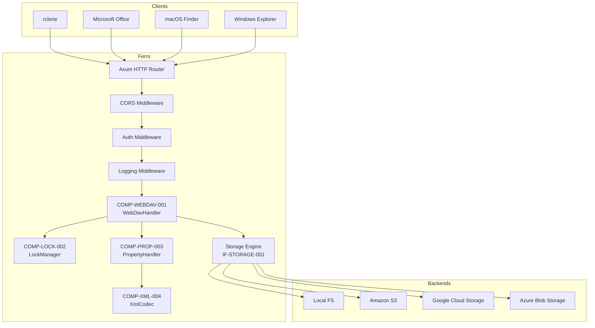
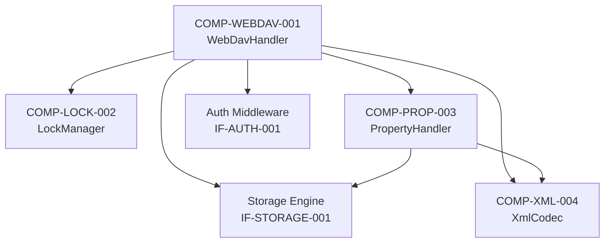
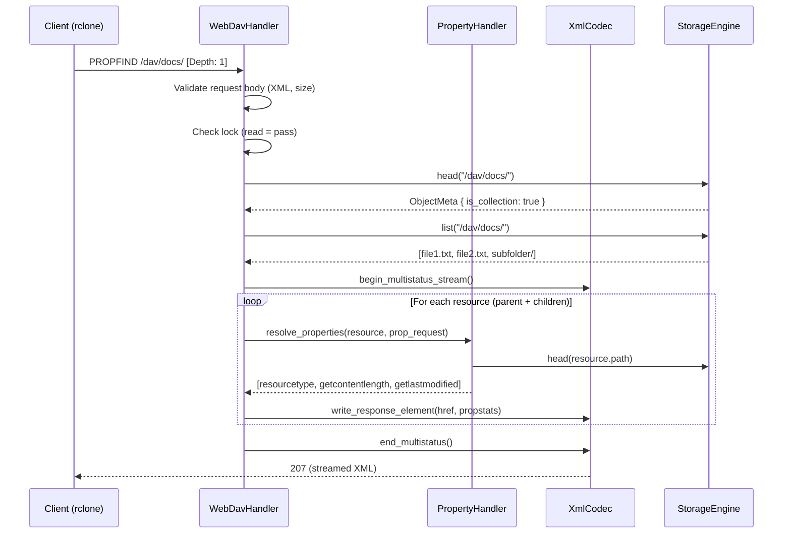
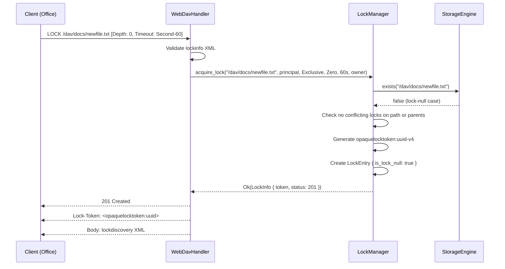
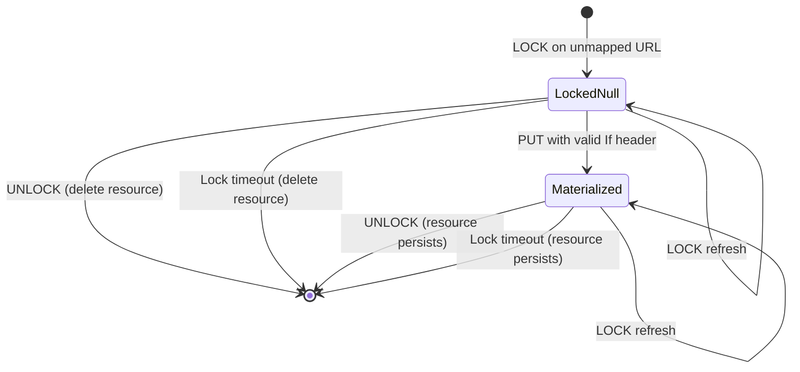

# BP-WEBDAV-HANDLER-001: WebDAV Handler Architectural Specification

## BP-1: Design Overview

### 1.1 Purpose

This Blue Paper specifies the architectural design for the Ferro WebDAV Handler component, a high-performance RFC 4918-compliant WebDAV server implementation targeting rclone and Microsoft Office compatibility. The design prioritizes streaming XML processing, sub-10ms lock acquisition, and correct handling of all WebDAV edge cases including lock-null resources, depth-infinity recursion, and multi-status error aggregation.

### 1.2 C4 Context Diagram



### 1.3 Stakeholders

| Stakeholder | Interest |
|---|---|
| End users (rclone) | Reliable file sync, directory listing, upload/download via WebDAV mount |
| Enterprise (Office) | Document locking, edit session management, save-as operations |
| System administrators | Lock monitoring, resource limits, audit logging |
| Developers | Clean component interfaces, testability, extensibility |

## BP-2: Design Decomposition

### 2.1 Component Hierarchy



### 2.2 Component Specifications

#### COMP-WEBDAV-001: WebDavHandler

| Field | Value |
|---|---|
| **ID** | COMP-WEBDAV-001 |
| **Responsibility** | Axum router configuration, HTTP method dispatch, request validation, response serialization |
| **Language** | Rust |
| **Crate** | `ferro-server` |
| **Concurrency Model** | Async (tokio), one task per request |
| **State** | Shared via `Arc<WebDavState>` (LockManager, Storage, PropertyStore) |

Routes managed:
- `PROPFIND /*path` → `handle_propfind`
- `PROPPATCH /*path` → `handle_proppatch`
- `MKCOL /*path` → `handle_mkcol`
- `COPY /*path` → `handle_copy`
- `MOVE /*path` → `handle_move`
- `LOCK /*path` → `handle_lock`
- `UNLOCK /*path` → `handle_unlock`
- `OPTIONS /*path` → `handle_options`
- `DELETE /*path` → `handle_delete`
- `GET /*path` → `handle_get` (pass-through to storage)
- `PUT /*path` → `handle_put` (with lock checking)
- `HEAD /*path` → `handle_head` (pass-through to storage)

#### COMP-LOCK-002: LockManager

| Field | Value |
|---|---|
| **ID** | COMP-LOCK-002 |
| **Responsibility** | Lock acquisition, refresh, release, conflict detection, lock-null lifecycle |
| **Language** | Rust |
| **Crate** | `ferro-core` |
| **Concurrency Model** | Async, internal `RwLock<HashMap>` with sharding |
| **Persistence** | WAL-based journal for crash recovery (Phase 2) |

#### COMP-PROP-003: PropertyHandler

| Field | Value |
|---|---|
| **ID** | COMP-PROP-003 |
| **Responsibility** | Live/dead property resolution, PROPFIND/PROPPATCH XML orchestration |
| **Language** | Rust |
| **Crate** | `ferro-core` |
| **State** | Delegates to storage engine for live properties; dead properties in sidecar store |

#### COMP-XML-004: XmlCodec

| Field | Value |
|---|---|
| **ID** | COMP-XML-004 |
| **Responsibility** | Streaming XML encoding/decoding for WebDAV request/response bodies |
| **Language** | Rust |
| **Crate** | `ferro-core` |
| **Dependencies** | `quick-xml` |

### 2.3 External Dependencies

| Dependency | Version | Purpose |
|---|---|---|
| `axum` | 0.7 | HTTP framework, router, middleware composition |
| `quick-xml` | 0.36 | Streaming XML parser/encoder |
| `tower` | 0.4 | Service trait, middleware layers |
| `tower-http` | 0.5 | CORS, compression middleware |
| `uuid` | 1.x | Lock token generation (opaquelocktoken) |
| `chrono` | 0.4 | Timestamp formatting (RFC 1123) |
| `bytes` | 1.x | Efficient buffer management |
| `tokio` | 1.x | Async runtime |

## BP-3: Design Rationale

### 3.1 ADR-002: Streaming XML for WebDAV Responses

| Field | Value |
|---|---|
| **Status** | Accepted |
| **Context** | PROPFIND with Depth:infinity on large collections can produce multi-hundred-MB XML responses |
| **Decision** | Use `quick-xml` in streaming mode (pull parser for requests, event writer for responses) |
| **Consequences** | O(1) per-element memory instead of O(N) DOM allocation; faster time-to-first-byte; more complex code than DOM-based approach |
| **Alternatives Considered** | serde-xml-rs (DOM, memory-intensive), roxmltree (read-only DOM, unsuitable for encoding), xml-rs (lower performance than quick-xml) |

### 3.2 ADR-003: In-Memory Lock Manager with Persistence

| Field | Value |
|---|---|
| **Status** | Accepted |
| **Context** | Lock state must survive server restart but latency must be < 10ms p99 |
| **Decision** | In-memory `DashMap`-based lock table with WAL journal for crash recovery |
| **Consequences** | Sub-microsecond lock acquisition; requires single-node deployment or distributed lock coordination (Phase 3+) |
| **Alternatives Considered** | SQLite-backed locks (too slow, 1-5ms per query), Redis-backed locks (adds operational complexity), database-backed locks (latency, schema coupling) |

### 3.3 ADR-004: Axum Tower Middleware for WebDAV

| Field | Value |
|---|---|
| **Status** | Accepted |
| **Context** | Need HTTP routing, middleware composition, and async request handling |
| **Decision** | Use Axum (tower-based) with method-specific handlers |
| **Consequences** | Composable middleware stack; excellent async performance; full control over HTTP semantics; no dependency on specialized WebDAV crates that may lag behind RFC updates |
| **Alternatives Considered** | warp (less ergonomic error handling), actix-web (different async model), dedicated WebDAV crates (incomplete RFC coverage, inflexible) |

### 3.4 ADR-005: Separate LockManager Component

| Field | Value |
|---|---|
| **Status** | Accepted |
| **Context** | Lock state machine is complex with exclusive/shared semantics, depth:infinity propagation, lock-null lifecycle, and timeout tracking |
| **Decision** | Extract LockManager as a standalone component behind IF-LOCK-001 interface |
| **Consequences** | Independent testability; clear interface boundary; future WOPI integration reuses same lock manager |
| **Alternatives Considered** | Inline lock logic in WebDavHandler (monolithic, untestable), external lock service (latency overhead) |

## BP-4: Traceability

### 4.1 Yellow Paper Algorithm Mapping

| BP Component | YP Algorithm | Purpose |
|---|---|---|
| COMP-WEBDAV-001 | ALG-PROPFIND-001 | Recursive property enumeration with depth control |
| COMP-WEBDAV-001 | ALG-COPY-001 | Recursive copy with overwrite semantics |
| COMP-WEBDAV-001 | YP-4.2 PROPPATCH | Property set/remove with error aggregation |
| COMP-WEBDAV-001 | YP-4.3 MKCOL | Collection creation with conflict detection |
| COMP-WEBDAV-001 | YP-4.5 MOVE | Atomic move with rollback on failure |
| COMP-WEBDAV-001 | YP-4.8 OPTIONS | Capability advertisement |
| COMP-LOCK-002 | ALG-LOCK-001 (ACQUIRE) | Lock acquisition with compatibility check |
| COMP-LOCK-002 | ALG-LOCK-001 (REFRESH) | Lock timeout extension |
| COMP-LOCK-002 | ALG-LOCK-001 (RELEASE) | Lock removal and lock-null cleanup |
| COMP-LOCK-002 | ALG-LOCK-001 (CHECK) | Pre-operation lock validation |
| COMP-PROP-003 | ALG-PROPFIND-001 (enumerate_properties) | Per-resource property resolution |
| COMP-XML-004 | N/A | XML encoding/decoding infrastructure |

### 4.2 Requirements Mapping

| Requirement | BP Components | Verification |
|---|---|---|
| REQ-WEBDAV-001 (Class 1) | COMP-WEBDAV-001, COMP-PROP-003, COMP-XML-004 | TV-PROP-001..007, TV-MKCOL-001, TV-COPY-001..004, TV-MOVE-001..002 |
| REQ-WEBDAV-002 (Class 2 Locking) | COMP-LOCK-002 | TV-LOCK-001..006 |
| REQ-WEBDAV-003 (Class 3 ACL) | COMP-WEBDAV-001 (via IF-AUTH-001) | Phase 2 integration tests |
| REQ-WEBDAV-004 (rclone compat) | COMP-WEBDAV-001, COMP-XML-004 | TV-RCLONE-001..004 |
| REQ-WEBDAV-005 (Office compat) | COMP-LOCK-002, COMP-WEBDAV-001 | TV-LOCK-001, TV-LOCK-004, TV-OPTIONS-001 |
| REQ-WEBDAV-006 (XML overhead) | COMP-XML-004 | Performance benchmarks: 10K items < 50ms p99 |

### 4.3 Domain Constraints Mapping

| Constraint | BP Component | Enforcement |
|---|---|---|
| DC-TIMING-001..005 | COMP-WEBDAV-001, COMP-LOCK-002 | SLO monitoring, streaming XML |
| DC-XML-001..006 | COMP-XML-004 | Parser configuration, streaming writer |
| DC-LOCK-001..007 | COMP-LOCK-002 | Configuration, lazy expiry |
| DC-PATH-001..005 | COMP-WEBDAV-001 | URL sanitization, depth limiting |
| DC-COMPAT-001..008 | COMP-WEBDAV-001 | Header handling, defaults |
| DC-SEC-001..004 | COMP-WEBDAV-001 | Parser config, rate limiting, auth middleware |

## BP-5: Interface Design

### 5.1 IF-WEBDAV-001: WebDavHandler

```rust
pub struct WebDavState {
    pub storage: Arc<dyn StorageEngine>,
    pub lock_manager: Arc<LockManager>,
    pub property_store: Arc<dyn PropertyStore>,
    pub config: WebDavConfig,
}

pub struct WebDavConfig {
    pub default_depth: Depth,
    pub max_request_body: usize,       // 1 MiB
    pub max_path_depth: usize,         // 100
    pub max_path_length: usize,        // 4096
    pub default_lock_timeout: Duration, // 60s
    pub max_lock_timeout: Duration,     // 3600s
    pub min_lock_timeout: Duration,     // 5s
    pub max_locks_per_principal: usize, // 1000
    pub max_depth_limit: usize,         // 100
}

pub enum Depth {
    Zero,
    One,
    Infinity,
}
```

#### Route: PROPFIND

| Field | Value |
|---|---|
| **Method** | PROPFIND |
| **Path** | `/*path` |
| **Request Headers** | `Depth: 0 | 1 | infinity` (default: `infinity`) |
| **Request Body** | `propfind` XML (optional; empty body defaults to `allprop`) |
| **Response Status** | 207 Multi-Status |
| **Response Body** | `multistatus` XML (streamed) |
| **Preconditions** | (1) Resource exists at request-URL, (2) Depth is valid, (3) Request body is well-formed XML <= 1 MiB |
| **Postconditions** | (1) Response contains one `response` element per matching resource, (2) Each `propstat` has correct status per property |
| **Error Responses** | 400 (malformed XML), 404 (resource not found), 413 (body too large), 502 (depth limit exceeded) |

#### Route: PROPPATCH

| Field | Value |
|---|---|
| **Method** | PROPPATCH |
| **Path** | `/*path` |
| **Request Headers** | `If` (lock token, if resource locked) |
| **Request Body** | `propertyupdate` XML |
| **Response Status** | 207 Multi-Status |
| **Preconditions** | (1) Resource exists, (2) Caller holds lock if resource locked, (3) `set` processed before `remove` |
| **Postconditions** | (1) Dead properties updated in property store, (2) Per-property status reported |
| **Error Responses** | 404, 409 (missing parent), 423 (locked), 413 |

#### Route: MKCOL

| Field | Value |
|---|---|
| **Method** | MKCOL |
| **Path** | `/*path` |
| **Request Body** | MUST be empty |
| **Response Status** | 201 Created |
| **Preconditions** | (1) Parent collection exists, (2) Resource does not exist |
| **Postconditions** | (1) Collection created at request-URL, (2) Trailing slash enforced |
| **Error Responses** | 405 (exists as non-collection), 409 (parent missing), 415 (body non-empty), 507 |

#### Route: COPY

| Field | Value |
|---|---|
| **Method** | COPY |
| **Path** | `/*path` |
| **Request Headers** | `Destination`, `Overwrite: T | F` (default: T), `Depth` |
| **Response Status** | 201 (created), 204 (overwritten), 207 (partial failure) |
| **Preconditions** | (1) Source exists, (2) Destination not descendant of source, (3) Locks held on both source and dest |
| **Postconditions** | (1) Content copied, (2) Dead properties copied, (3) Live properties recalculated, (4) Locks NOT transferred |
| **Error Responses** | 403 (copy to own subtree), 404 (source missing), 412 (overwrite:F + dest exists), 423 (locked), 507 |

#### Route: MOVE

| Field | Value |
|---|---|
| **Method** | MOVE |
| **Path** | `/*path` |
| **Request Headers** | `Destination`, `Overwrite: T | F` (default: T) |
| **Response Status** | 201 (created), 204 (overwritten), 207 (partial failure) |
| **Preconditions** | (1) Source != Destination, (2) Source exists, (3) Locks held |
| **Postconditions** | (1) Resource at source deleted, (2) Resource at destination created, (3) Atomic (424 if DELETE fails after COPY) |
| **Error Responses** | 403 (move to self), 404, 412, 423, 424 |

#### Route: LOCK

| Field | Value |
|---|---|
| **Method** | LOCK |
| **Path** | `/*path` |
| **Request Headers** | `Depth: 0 | infinity`, `Timeout: Second-N | Infinite` |
| **Request Body** | `lockinfo` XML (creation) or empty (refresh) |
| **Response Status** | 200 (refresh/existing), 201 (new lock / lock-null) |
| **Response Headers** | `Lock-Token: <opaquelocktoken:uuid>` |
| **Preconditions** | (1) Creation: no conflicting lock, (2) Refresh: valid token, (3) Principal within lock limit |
| **Postconditions** | (1) Lock entry in lock table, (2) Lock-null resource created if URL unmapped, (3) Token returned in header and body |
| **Error Responses** | 403 (forbidden), 409 (lock expired), 412 (If header failed), 423 (conflicting lock), 507 |

#### Route: UNLOCK

| Field | Value |
|---|---|
| **Method** | UNLOCK |
| **Path** | `/*path` |
| **Request Headers** | `Lock-Token: <opaquelocktoken:uuid>` |
| **Response Status** | 204 No Content |
| **Preconditions** | (1) Valid lock token, (2) Principal is lock owner or has `unlock` privilege |
| **Postconditions** | (1) Lock removed from table, (2) Lock-null resource deleted if unmapped |
| **Error Responses** | 400 (missing/malformed token), 403 (not owner), 409 (no lock on resource) |

#### Route: OPTIONS

| Field | Value |
|---|---|
| **Method** | OPTIONS |
| **Path** | `/*path` |
| **Response Headers** | `DAV: 1, 2`, `Allow: GET, HEAD, PUT, DELETE, PROPFIND, PROPPATCH, MKCOL, COPY, MOVE, LOCK, UNLOCK, OPTIONS` |
| **Preconditions** | None |
| **Postconditions** | (1) DAV header advertises Class 1 and Class 2 compliance |

#### Route: DELETE

| Field | Value |
|---|---|
| **Method** | DELETE |
| **Path** | `/*path` |
| **Request Headers** | `If` (lock token) |
| **Response Status** | 204 No Content |
| **Preconditions** | (1) Resource exists, (2) Caller holds lock |
| **Postconditions** | (1) Resource removed from storage, (2) Associated dead properties removed |

### 5.2 IF-LOCK-001: LockManager

```rust
pub struct LockToken(pub Uri); // opaquelocktoken:<uuid-v4>

pub enum LockScope {
    Exclusive,
    Shared,
}

pub enum LockType {
    Write,
}

pub struct LockInfo {
    pub token: LockToken,
    pub path: String,
    pub principal: String,
    pub scope: LockScope,
    pub lock_type: LockType,
    pub depth: Depth,
    pub timeout: Instant,
    pub created_at: Instant,
    pub owner_xml: String,
    pub is_lock_null: bool,
}

pub enum LockStatus {
    NotLocked,
    LockedBySelf(LockToken),
    LockedByOther { principal: String, scope: LockScope },
}

pub trait LockManager: Send + Sync {
    async fn acquire_lock(
        &self,
        path: &str,
        principal: &str,
        scope: LockScope,
        depth: Depth,
        timeout: Duration,
        owner_xml: &str,
    ) -> Result<LockInfo, LockError>;

    async fn refresh_lock(
        &self,
        token: &LockToken,
        timeout: Duration,
        principal: &str,
    ) -> Result<LockInfo, LockError>;

    async fn release_lock(
        &self,
        token: &LockToken,
        principal: &str,
    ) -> Result<(), LockError>;

    async fn check_lock(
        &self,
        path: &str,
        principal: &str,
        method: &str,
    ) -> Result<LockStatus, LockError>;

    async fn get_lock(&self, token: &LockToken) -> Result<Option<LockInfo>, LockError>;

    async fn cleanup_expired(&self, path: &str);
}
```

### 5.3 IF-STORAGE-001: Storage Engine (Dependency)

```rust
pub trait StorageEngine: Send + Sync {
    async fn head(&self, path: &str) -> Result<ObjectMeta, StorageError>;
    async fn get(&self, path: &str) -> Result<GetResult, StorageError>;
    async fn put(&self, path: &str, data: Bytes) -> Result<PutResult, StorageError>;
    async fn delete(&self, path: &str) -> Result<(), StorageError>;
    async fn list(&self, prefix: &str) -> Result<Vec<ObjectMeta>, StorageError>;
    async fn create_dir(&self, path: &str) -> Result<(), StorageError>;
    async fn copy(&self, from: &str, to: &str) -> Result<(), StorageError>;
    async fn copy_dir(&self, from: &str, to: &str) -> Result<(), StorageError>;
    async fn rename(&self, from: &str, to: &str) -> Result<(), StorageError>;
    async fn exists(&self, path: &str) -> Result<bool, StorageError>;
}
```

### 5.4 IF-PROP-001: PropertyStore (Dependency)

```rust
pub trait PropertyStore: Send + Sync {
    async fn get_properties(&self, path: &str) -> Result<Vec<WebDavProperty>, StorageError>;
    async fn get_property(&self, path: &str, name: &str, ns: &str) -> Result<Option<String>, StorageError>;
    async fn set_property(&self, path: &str, prop: WebDavProperty) -> Result<(), StorageError>;
    async fn remove_property(&self, path: &str, name: &str, ns: &str) -> Result<(), StorageError>;
    async fn list_property_names(&self, path: &str) -> Result<Vec<(String, String)>, StorageError>;
}
```

## BP-6: Data Design

### 6.1 Core Data Types

#### LockInfo

| Field | Type | Description |
|---|---|---|
| `token` | `LockToken` | `opaquelocktoken:<uuid-v4>` per RFC 4918 Appendix C |
| `path` | `String` | Canonical URL path of locked resource |
| `principal` | `String` | Authenticated principal identifier |
| `scope` | `LockScope` | `Exclusive` or `Shared` |
| `lock_type` | `LockType` | `Write` (only defined type) |
| `depth` | `Depth` | `Zero` or `Infinity` |
| `timeout` | `Instant` | Absolute expiry timestamp |
| `created_at` | `Instant` | Lock creation timestamp |
| `owner_xml` | `String` | Raw XML fragment from lockinfo owner element |
| `is_lock_null` | `bool` | True if resource was unmapped at lock time |

#### WebDavProperty

| Field | Type | Description |
|---|---|---|
| `namespace` | `String` | XML namespace URI |
| `name` | `String` | Local element name |
| `value` | `Option<String>` | XML fragment value (None for propname queries) |

#### MultiStatusResponse

| Field | Type | Description |
|---|---|---|
| `responses` | `Vec<ResponseElement>` | One per matching resource |
| `response_description` | `Option<String>` | Optional top-level description |

#### ResponseElement

| Field | Type | Description |
|---|---|---|
| `href` | `String` | Canonical resource URL |
| `propstats` | `Vec<PropStat>` | Property results grouped by status |
| `status` | `Option<u16>` | Shortcut for single-status resources |
| `error` | `Option<ErrorElement>` | Error detail per RFC 4918 §16 |
| `responsedescription` | `Option<String>` | Optional description |

#### PropStat

| Field | Type | Description |
|---|---|---|
| `prop` | `Vec<WebDavProperty>` | Properties with this status |
| `status` | `u16` | HTTP status code (200, 404, etc.) |
| `responsedescription` | `Option<String>` | Optional description |

### 6.2 XML Request Schemas

```xml
<!-- PROPFIND request -->
<D:propfind xmlns:D="DAV:">
  <D:prop> | <D:allprop> | <D:propname>
    [<D:include>...</D:include>]
  </D:prop> | </D:allprop> | </D:propname>
</D:propfind>

<!-- PROPPATCH request -->
<D:propertyupdate xmlns:D="DAV:">
  <D:set><D:prop>...properties...</D:prop></D:set>
  <D:remove><D:prop>...properties...</D:prop></D:remove>
</D:propertyupdate>

<!-- LOCK request (creation) -->
<D:lockinfo xmlns:D="DAV:">
  <D:locktype><D:write/></D:locktype>
  <D:lockscope><D:exclusive/> | <D:shared/></D:lockscope>
  <D:owner>...XML fragment...</D:owner>
</D:lockinfo>
```

### 6.3 XML Response Schemas

```xml
<!-- PROPFIND / PROPPATCH response -->
<?xml version="1.0" encoding="utf-8"?>
<D:multistatus xmlns:D="DAV:">
  <D:response>
    <D:href>...</D:href>
    <D:propstat>
      <D:prop>...properties...</D:prop>
      <D:status>HTTP/1.1 200 OK</D:status>
    </D:propstat>
    [<D:propstat>
      <D:prop>...missing properties...</D:prop>
      <D:status>HTTP/1.1 404 Not Found</D:status>
    </D:propstat>]
  </D:response>
  ...
</D:multistatus>

<!-- LOCK response -->
<?xml version="1.0" encoding="utf-8"?>
<D:prop xmlns:D="DAV:">
  <D:lockdiscovery>
    <D:activelock>
      <D:locktype><D:write/></D:locktype>
      <D:lockscope><D:exclusive/> | <D:shared/></D:lockscope>
      <D:depth>0 | infinity</D:depth>
      <D:owner>...XML fragment...</D:owner>
      <D:timeout>Second-N | Infinite</D:timeout>
      <D:locktoken><D:href>opaquelocktoken:uuid</D:href></D:locktoken>
      <D:lockroot><D:href>...</D:href></D:lockroot>
    </D:activelock>
  </D:lockdiscovery>
</D:prop>
```

## BP-7: Component Design

### 7.1 Axum Router Configuration

```rust
pub fn webdav_router(state: WebDavState) -> Router {
    Router::new()
        .route("/*path", get(handle_head).head(handle_head))
        .route("/*path", put(handle_put))
        .route("/*path", delete(handle_delete))
        .route("/*path", post(handle_webdav_method))
        .route("/*path", options(handle_options))
        .layer(middleware::from_fn_with_state(
            state.clone(),
            path_normalization,
        ))
        .layer(middleware::from_fn_with_state(
            state.clone(),
            request_size_limit,
        ))
        .with_state(state)
}

async fn handle_webdav_method(
    method: Method,
    path: Path<String>,
    state: State<WebDavState>,
    req: Request,
) -> Response {
    match method.as_str() {
        "PROPFIND" => handle_propfind(path, state, req).await,
        "PROPPATCH" => handle_proppatch(path, state, req).await,
        "MKCOL" => handle_mkcol(path, state, req).await,
        "COPY" => handle_copy(path, state, req).await,
        "MOVE" => handle_move(path, state, req).await,
        "LOCK" => handle_lock(path, state, req).await,
        "UNLOCK" => handle_unlock(path, state, req).await,
        _ => StatusCode::method_not_allowed().into_response(),
    }
}
```

### 7.2 Middleware Stack

```
Request → CORS → Auth → Rate Limit → Request Size Limit → Path Normalization → WebDavHandler → Response
```

| Layer | Implementation | Purpose |
|---|---|---|
| CORS | `tower_http::cors::CorsLayer` | Cross-origin for web frontend |
| Auth | `middleware::from_fn(auth_middleware)` | JWT validation, principal extraction |
| Rate Limit | `tower_governor::GovernorLayer` | Per-IP rate limiting (default 100 req/s) |
| Request Size Limit | Custom middleware | Reject bodies > 1 MiB (DC-XML-002) |
| Path Normalization | Custom middleware | Trailing slash enforcement, `..` rejection (DC-PATH-003, DC-PATH-004) |

### 7.3 Sequence: PROPFIND Depth:1



### 7.4 Sequence: LOCK (New Lock)



### 7.5 Lock-Null Resource State Machine



Transitions:
1. **LockedNull**: Created by LOCK on unmapped URL. Invisible in PROPFIND to non-owners. Deleted on UNLOCK/timeout.
2. **Materialized**: Created by PUT to lock-null URL. Persists after UNLOCK/timeout.
3. **Refresh**: Both states support LOCK refresh (same token, new timeout).

## BP-8: Deployment Design

### 8.1 Single Binary Deployment

The WebDAV handler is compiled into the `ferro-server` binary. No separate processes or external services are required for core WebDAV functionality.

### 8.2 Resource Requirements

| Resource | Baseline | 10K concurrent PROPFIND | Notes |
|---|---|---|---|
| Memory (per request) | ~8 KB | ~8 KB | Streaming XML: O(1) per element |
| Memory (lock table) | ~1 MB | ~10 MB | ~256 bytes per lock entry |
| Memory (dead properties) | ~10 MB | ~100 MB | SQLite or xattr sidecar |
| CPU (PROPFIND) | Minimal | Moderate | XML serialization is CPU-bound |
| CPU (LOCK) | Minimal | Minimal | In-memory hashmap lookup |
| Disk | Application binary | Dead property storage | No temporary files for streaming |

### 8.3 Configuration

```toml
[webdav]
bind = "0.0.0.0:8080"
root_path = "/dav"
default_depth = "infinity"
max_request_body = 1048576
max_path_depth = 100
max_path_length = 4096

[webdav.locking]
default_timeout_secs = 60
max_timeout_secs = 3600
min_timeout_secs = 5
max_locks_per_principal = 1000

[webdav.compatibility]
dav_header = "1, 2"
content_type = 'text/xml; charset="utf-8"'
case_sensitive = true
```

## BP-9: Formal Verification

### 9.1 PROP-WEBDAV-001: PROPFIND Completeness

**Property**: For any PROPFIND request with Depth D on collection C, the response contains exactly the set of resources R where R = {C} union descendants(C, D), excluding lock-null resources not owned by the requestor.

**Formal Statement**:
```
∀ req: PropFindRequest, C: Collection
  let R = resources_matching(req, C) in
  let Resp = propfind(req, C) in
  |{ r.href | r ∈ Resp.responses }| = |R| ∧
  ∀ r ∈ R: ∃ resp ∈ Resp.responses: resp.href = canonical(r)
```

**Proof Strategy** (see `proofs/proof_webdav.lean`):
- Induction on depth (0, 1, infinity)
- Base case: Depth 0 returns exactly the target resource
- Inductive step: Depth n returns target union children enumerated at depth n-1
- Lock-null filter: set difference of all resources minus lock-null resources not owned by principal

### 9.2 PROP-WEBDAV-002: LOCK Exclusivity

**Property**: If an exclusive lock exists on resource R held by principal P1, then no lock acquisition by principal P2 ≠ P1 on R can succeed, and no write operation by P2 on R can succeed.

**Formal Statement**:
```
∀ L: LockEntry, R: Resource, P1, P2: Principal
  L.path = R ∧ L.scope = Exclusive ∧ L.owner = P1 ∧ ¬expired(L) ∧ P2 ≠ P1 →
    acquire_lock(R, P2, _, _, _, _) = Error(423) ∧
    check_lock(R, P2, "PUT") = Error(423)
```

**Proof Strategy** (see `proofs/proof_webdav.lean`):
- Case analysis on requested lock scope (exclusive, shared)
- Exclusive request: compatibility table forbids coexistence
- Shared request: compatibility table forbids shared with exclusive
- Write operation check: traverses lock table, finds exclusive lock by different principal

### 9.3 PROP-WEBDAV-003: Lock Timeout Correctness

**Property**: Any lock L with timeout T is automatically considered expired at any time t > T. Expired locks MUST NOT block any operation and MUST NOT appear in lockdiscovery responses.

**Formal Statement**:
```
∀ L: LockEntry, t: Instant
  t > L.timeout →
    is_expired(L, t) = true ∧
    check_lock(L.path, _, _) ≠ Error(423, L) ∧
    L ∉ get_lockdiscovery(L.path, t)
```

**Proof Strategy** (see `proofs/proof_webdav.lean`):
- Expired check is defined as `t > timeout`
- `check_lock` filters expired locks before evaluating conflicts
- Lazy cleanup removes expired entries on next access
- Lock refresh updates timeout to `now() + requested_duration`

## BP-10: Glossary

| Term | Definition |
|---|---|
| **Collection** | A WebDAV resource that acts as a container for child resources |
| **Dead Property** | A property stored verbatim by the server with no server-enforced semantics |
| **Depth** | HTTP header controlling recursion: 0 (self only), 1 (self + children), infinity (all descendants) |
| **Live Property** | A property whose value is computed by the server from resource metadata |
| **Lock-Null Resource** | A resource created by LOCK on an unmapped URL, invisible until materialized via PUT |
| **Multi-Status** | 207 response aggregating per-resource status codes |
| **Opaque Lock Token** | RFC 4918 URI identifying a specific lock instance (`opaquelocktoken:<uuid>`) |
| **Principal** | An authenticated user or service identity |

## BP-11: References

| Ref | Citation |
|---|---|
| [RFC 4918] | Dusseault, L., "HTTP Extensions for Web Distributed Authoring and Versioning (WebDAV)", RFC 4918, June 2007 |
| [RFC 3253] | Clemm, G., et al., "Versioning Extensions to WebDAV", RFC 3253, March 2002 |
| [RFC 3744] | Clemm, G., et al., "WebDAV Access Control Protocol", RFC 3744, May 2004 |
| [RFC 3986] | Berners-Lee, T., et al., "URI Generic Syntax", RFC 3986, January 2005 |
| [IEEE 1016] | IEEE Standard for Information Technology — Systems Design — Software Design Descriptions |
| [YP-WEBDAV-PROTOCOL-001] | Ferro Yellow Paper: WebDAV Protocol Specification |
| [FERRO-REQ-001] | Ferro System Requirements — EARS Specification |
| [DC-WEBDAV] | Ferro Domain Constraints for WebDAV |
| [TV-WEBDAV] | Ferro Test Vectors for WebDAV |

## BP-12: Revision History

| Version | Date | Author | Description |
|---|---|---|---|
| 1.0.0 | 2026-04-18 | Construct (Systems Architect) | Initial architectural specification |
