# Crate Dependency Graph

```mermaid
graph TD
    %% Layer 0: Foundation
    common

    %% Layer 1: Core
    core --> common
    auth --> common
    crypto
    circuit-breaker
    crdt
    consistent-hash
    rate-limiter
    event-bus
    selective-sync
    migrate
    cache
    health --> common

    %% Layer 2: Domain / Protocol
    dav --> common
    caldav --> dav
    webdav-handler --> common
    sync-protocol --> common
    offline --> common
    distributed --> common
    graphql --> common

    %% Layer 3: Infrastructure / Middleware
    server-security --> common
    server-security --> auth
    server-security-middleware --> auth
    server-security-middleware --> server-security
    server-versioning --> common
    server-versioning --> core
    server-activitypub --> common
    server-integrations --> common
    server-integrations --> circuit-breaker
    server-integrations --> offline
    server-integrations --> server-security-middleware
    server-sharing --> common
    server-sharing --> core
    server-sharing --> auth
    server-sharing --> server-activitypub
    server-sharing --> server-security-middleware
    server-collaboration --> common
    server-collaboration --> server-security
    server-collaboration --> server-security-middleware
    server-collaboration --> crdt
    server-compliance --> common
    server-compliance --> circuit-breaker
    server-compliance --> server-security
    server-compliance --> server-security-middleware
    server-content --> common
    server-content --> server-security
    server-content --> server-security-middleware
    server-storage-ops --> common
    server-storage-ops --> core
    server-storage-ops --> server-security
    server-storage-ops --> server-security-middleware
    server-plugins --> core
    server-admin-api --> common
    server-admin-api --> server-security
    server-admin-api --> server-security-middleware
    server-admin-api --> core
    server-admin-api --> auth
    server-user-mgmt --> common
    server-user-mgmt --> auth
    server-user-mgmt --> server-security
    server-user-mgmt --> server-security-middleware
    server-user-mgmt --> server-integrations
    server-user-mgmt --> server-sharing
    server-api-core --> common
    server-api-core --> core
    server-api-core --> event-bus
    server-api-core --> server-security
    server-api-core --> server-integrations
    server-api-core --> server-security-middleware
    server-automation --> common
    server-automation --> core
    server-automation --> auth
    server-automation --> server-integrations
    server-webdav-core --> common
    server-webdav-core --> core
    server-webdav-core --> dav
    server-webdav-core --> offline
    server-webdav-core --> server-compliance
    server-webdav-core --> server-security
    server-webdav-core --> server-security-middleware
    server-webdav-core --> server-storage-ops
    server-webdav-core --> server-versioning
    server-webdav-core --> webdav-handler
    server-productivity --> common
    server-productivity --> dav
    server-state --> common
    server-state --> auth
    server-state --> core
    server-state --> server-sharing
    server-state --> server-api-core
    server-state --> server-collaboration
    server-state --> server-storage-ops
    server-state --> server-compliance
    server-routes --> common
    server-routes --> server-state
    server-routes --> server-security-middleware
    server-routes --> server-storage-ops
    server-routes --> server-webdav-core
    server-routes --> server-collaboration
    server-routes --> server-compliance
    server-routes --> server-admin-api
    server-routes --> server-integrations
    server-routes --> server-api-core
    server-routes --> server-user-mgmt
    server-routes --> server-productivity
    server-routes --> server-content
    server-routes --> server-sharing
    server-routes --> auth
    server-routes --> core
    server-routes --> rate-limiter
    server-routes --> cache
    server-routes --> health
    server-routes --> multi-tenant
    server-routes --> offline
    server-routes --> selective-sync
    server-infra --> common
    server-infra --> circuit-breaker
    server-infra --> server-activitypub
    server-infra --> server-security
    server-infra --> server-security-middleware
    server-infra --> server-api-core
    server-infra --> server-sharing

    %% Layer 4: Application
    server --> common
    server --> webdav-handler
    server --> server-webrtc
    server --> auth
    server --> server-activitypub
    server --> server-wopi
    server --> server-versioning
    server --> graphql
    server --> core
    server --> dav
    server --> rate-limiter
    server --> cache
    server --> health
    server --> multi-tenant
    server --> mount-nfs
    server --> event-bus
    server --> ai
    server --> crdt
    server --> distributed
    server --> offline
    server --> server-security
    server --> server-security-middleware
    server --> server-content
    server --> server-compliance
    server --> server-integrations
    server --> server-plugins
    server --> server-admin-api
    server --> circuit-breaker
    server --> server-api-core
    server --> selective-sync
    server --> server-sharing
    server --> server-user-mgmt

    %% Layer 5: Clients / Tools
    web --> common
    web --> crdt
    cli --> common
    cli --> migrate
    client --> selective-sync
    desktop
    mobile
    admin --> common

    %% Testing / Benchmarks
    benchmarks --> core
    benchmarks --> common
    benchmarks --> dav
    benchmarks --> crypto
    benchmarks --> auth
```

## Key Architectural Layers

### Layer 0: Foundation
- `common` - Shared types, traits, error types (zero internal deps)

### Layer 1: Core / Building Blocks
- `core` - Storage engine, CAS, search, metadata
- `auth` - Authentication, OIDC, Cedar, TOTP
- `crypto` - Cryptographic primitives
- `circuit-breaker` - Resilience pattern
- `crdt` - Conflict-free replicated data types
- `consistent-hash` - Consistent hashing
- `rate-limiter` - Rate limiting
- `event-bus` - Event publishing
- `selective-sync` - Sync filtering
- `migrate` - Database migrations
- `cache` - Caching layer
- `health` - Health checks

### Layer 2: Domain / Protocol
- `dav` - DAV protocol types
- `caldav` - CalDAV protocol
- `webdav-handler` - WebDAV request handling
- `sync-protocol` - Sync protocol
- `offline` - Offline support
- `distributed` - Distributed operations
- `graphql` - GraphQL schema

### Layer 3: Infrastructure / Middleware
- `server-security` - Auth context, permissions
- `server-security-middleware` - Security middleware
- `server-versioning` - Version management
- `server-activitypub` - ActivityPub federation
- `server-integrations` - Third-party integrations
- `server-sharing` - Share management
- `server-collaboration` - Comments, tags, rooms
- `server-compliance` - WORM, retention, antivirus
- `server-content` - Content management
- `server-storage-ops` - Storage operations
- `server-plugins` - Plugin system
- `server-admin-api` - Admin API
- `server-user-mgmt` - User management
- `server-api-core` - API core abstractions
- `server-automation` - Automation rules
- `server-webdav-core` - WebDAV core logic
- `server-productivity` - Productivity features
- `server-state` - State trait definitions
- `server-routes` - Route handlers
- `server-infra` - Infrastructure wiring

### Layer 4: Application
- `server` - Main binary, handlers, startup

### Layer 5: Clients / Tools
- `web` - Web frontend
- `cli` - CLI tool
- `client` - Client library
- `desktop` - Desktop app
- `mobile` - Mobile app
- `admin` - Admin tools

### Testing / Benchmarks
- `benchmarks` - Performance benchmarks
