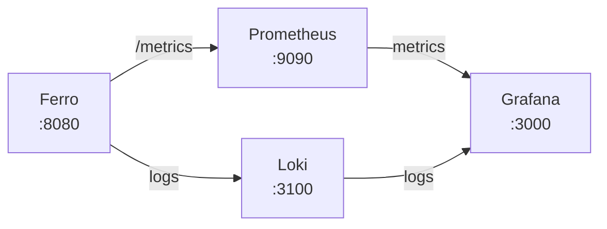
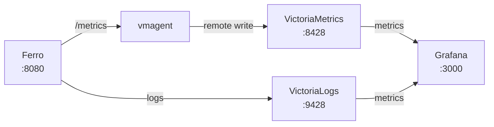

# Ferro Monitoring Stack

Monitoring for Ferro with pre-built dashboards and alerting rules. Supports two monitoring stacks:

- **Grafana + Loki** — Industry-standard log aggregation with Prometheus metrics
- **VictoriaMetrics + VictoriaLogs** — High-performance alternative with lower resource usage

## Quick Start

### Option A: Grafana + Loki

```bash
docker compose -f deploy/monitoring/docker-compose.grafana-loki.yml up -d
```

### Option B: VictoriaMetrics + VictoriaLogs

```bash
docker compose -f deploy/monitoring/docker-compose.victoria.yml up -d
```

Grafana will be available at `http://localhost:3000` (default credentials: `admin` / `admin`).

## Architecture

### Grafana + Loki Stack



### VictoriaMetrics + VictoriaLogs Stack



## Feature Comparison

| Feature | Grafana + Loki | VictoriaMetrics + VictoriaLogs |
|---------|---------------|-------------------------------|
| Metrics storage | Prometheus | VictoriaMetrics |
| Log storage | Loki | VictoriaLogs |
| Query language | PromQL + LogQL | PromQL + LogsQL |
| Resource usage | Higher | Lower |
| Long-term storage | Requires extra config | Built-in |
| High cardinality | Good | Excellent |
| Prometheus compatibility | Native | Native (PromQL-compatible) |
| Community plugins | Extensive | Growing |
| Docker Compose | `docker-compose.grafana-loki.yml` | `docker-compose.victoria.yml` |

## Importing Dashboards

1. Open Grafana at `http://localhost:3000`
2. Navigate to **Dashboards** > **Import**
3. Upload the JSON files from `deploy/monitoring/dashboards/`:

### Grafana + Loki Dashboards

| Dashboard | File | Description |
|-----------|------|-------------|
| Logs Overview | `grafana-loki/logs-overview.json` | Log volume, errors, sources, full-text search |
| Audit Log | `grafana-loki/audit-log.json` | Audit events, action breakdown, user activity |

### VictoriaMetrics Dashboards

| Dashboard | File | Description |
|-----------|------|-------------|
| Overview | `victoriametrics/overview.json` | HTTP, storage, federation, CRDT sync |
| Logs Overview | `victoriametrics/logs-overview.json` | Log volume, errors, ingestion, query performance |

### Stack-Agnostic Dashboards

| Dashboard | File | Description |
|-----------|------|-------------|
| Server Overview | `ferro-overview.json` | HTTP, resources, storage, federation |
| WebDAV | `ferro-webdav.json` | WebDAV/CalDAV/CardDAV operations and performance |
| Admin Dashboard | `admin-dashboard.json` | Combined admin view (works with either stack) |

### Datasource Variables

When importing, select the appropriate datasource for each variable:

- `${DS_PROMETHEUS}` — Prometheus or VictoriaMetrics
- `${DS_LOKI}` — Loki datasource
- `${DS_VICTORIAMETRICS}` — VictoriaMetrics datasource
- `${DS_VICTORIALOGS}` — VictoriaLogs datasource

Dashboards are also auto-provisioned if you use the provided Docker Compose config (they mount into `/etc/grafana/provisioning/dashboards/`).

## Available Metrics

### Standard (Prometheus default exporter)

| Metric | Description |
|--------|-------------|
| `up` | Target health (1 = up, 0 = down) |
| `process_cpu_seconds_total` | Total CPU time |
| `process_resident_memory_bytes` | Resident memory (RSS) |
| `process_open_fds` | Open file descriptors |
| `process_max_fds` | Maximum file descriptors |
| `process_start_time_seconds` | Process start time |

### HTTP

| Metric | Description |
|--------|-------------|
| `http_requests_total` | Total HTTP requests (labels: `method`, `status`) |
| `http_request_duration_seconds_bucket` | Request latency histogram |
| `http_request_duration_seconds_sum` | Request latency sum |
| `http_request_duration_seconds_count` | Request latency count |
| `http_request_size_bytes_sum` | Total request bytes |
| `http_response_size_bytes_sum` | Total response bytes |

### Application

| Metric | Description |
|--------|-------------|
| `ferro_active_connections` | Current active connections |
| `ferro_storage_health_status` | Storage backend health (1 = healthy) |
| `ferro_storage_files_total` | Total files in storage |
| `ferro_storage_bytes_total` | Total bytes in storage |
| `ferro_storage_capacity_bytes` | Storage capacity |
| `ferro_storage_trash_bytes_total` | Trash size |
| `ferro_storage_operations_total` | Storage operations (label: `operation`) |
| `ferro_federation_inbox_total` | Federation inbox deliveries |
| `ferro_federation_delivery_total` | Federation outgoing deliveries |
| `ferro_federation_errors_total` | Federation errors |
| `ferro_federation_followers` | Followers count |
| `ferro_federation_following` | Following count |
| `ferro_version_info` | Server version info |
| `ferro_auth_failures_total` | Failed authentication attempts |
| `ferro_auth_attempts_total` | Authentication attempts (label: `result`) |
| `ferro_active_sessions` | Active sessions |

### WebDAV / CalDAV / CardDAV

| Metric | Description |
|--------|-------------|
| `ferro_webdav_sync_token_usage_total` | Sync-Token usage count |
| `ferro_caldav_report_total` | CalDAV REPORT requests |
| `ferro_caldav_operations_total` | Calendar operations (label: `operation`) |
| `ferro_carddav_report_total` | CardDAV REPORT requests |
| `ferro_carddav_operations_total` | Address book operations (label: `operation`) |

### CRDT Sync

| Metric | Description |
|--------|-------------|
| `ferro_crdt_sync_operations_total` | Sync operations (label: `operation`) |
| `ferro_crdt_sync_sessions_active` | Active sync sessions |

## Available Alerts

### Infrastructure (`alerts/infrastructure.yml`)

| Alert | Severity | Condition |
|-------|----------|-----------|
| FerroInstanceDown | critical | Instance unreachable for 1 minute |
| FerroHighMemoryUsage | warning | Memory usage > 85% for 5 minutes |
| FerroHighCPUUsage | warning | CPU usage > 80% for 5 minutes |
| FerroHighFileDescriptorUsage | warning | FD usage > 80% for 5 minutes |
| FerroDiskSpaceLow | warning | Disk space < 15% on /data for 5 minutes |

### Application (`alerts/application.yml`)

| Alert | Severity | Condition |
|-------|----------|-----------|
| FerroHighErrorRate | warning | 5xx rate > 5% for 5 minutes |
| FerroHighLatency | warning | P95 latency > 5s for 10 minutes |
| FerroRequestRateAnomaly | info | Rate deviates > 200% from 7-day average for 30 minutes |
| FerroStorageHealthDegraded | critical | Storage health check failing for 2 minutes |

## Configuring Alerting Channels

Edit `alertmanager.yml` to add notification integrations:

### Slack

```yaml
receivers:
  - name: 'critical'
    slack_configs:
      - api_url: 'https://hooks.slack.com/services/...'
        channel: '#alerts-critical'
        send_resolved: true
```

### Email

```yaml
receivers:
  - name: 'critical'
    email_configs:
      - to: 'oncall@example.com'
        from: 'alertmanager@example.com'
        smarthost: 'smtp.example.com:587'
        auth_username: 'alertmanager@example.com'
        auth_password_file: '/etc/alertmanager/email-password'
```

### PagerDuty

```yaml
receivers:
  - name: 'critical'
    pagerduty_configs:
      - service_key: '<your-pagerduty-service-key>'
        severity: '{{ .GroupLabels.severity }}'
```

## File Structure

```
deploy/monitoring/
├── prometheus.yml                          # Prometheus scrape config (original)
├── prometheus-loki.yml                     # Prometheus scrape config for Loki stack
├── prometheus-vm.yml                       # Prometheus scrape config for VictoriaMetrics
├── docker-compose.grafana-loki.yml         # Docker Compose: Grafana + Loki
├── docker-compose.victoria.yml             # Docker Compose: VictoriaMetrics + VictoriaLogs
├── alertmanager.yml                        # Alert routing & receivers
├── alerts/
│   ├── infrastructure.yml                  # Infrastructure alerts
│   └── application.yml                     # Application alerts
├── dashboards/
│   ├── ferro-overview.json                 # Overview dashboard (Prometheus)
│   ├── ferro-webdav.json                   # WebDAV dashboard (Prometheus)
│   ├── admin-dashboard.json                # Combined admin dashboard (any stack)
│   ├── grafana-loki/
│   │   ├── logs-overview.json              # Log overview (Loki)
│   │   └── audit-log.json                  # Audit log viewer (Loki)
│   └── victoriametrics/
│       ├── overview.json                   # Overview (VictoriaMetrics)
│       └── logs-overview.json              # Log overview (VictoriaLogs)
├── vl-provisioning/
│   └── defaults.yml                        # VictoriaLogs provisioning defaults
└── README.md
```
