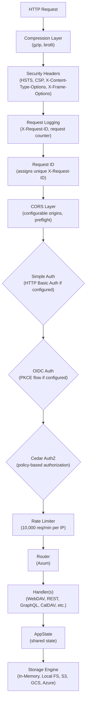

# Architecture

## Crate Structure

Ferro is built as a Rust workspace with 46 crates organized by functional domain:

```mermaid
graph LR
    subgraph Client ["Client & UI"]
        Web["ferro-web<br/>(Leptos WASM frontend)"]
        Desktop["ferro-desktop<br/>(Tauri desktop app)"]
        CLI["ferro-cli<br/>(admin CLI)"]
        Client["ferro-client<br/>(WebDAV client SDK)"]
        Mobile["ferro-mobile<br/>(Tauri v2 iOS/Android)"]
    end

    subgraph Server ["Server"]
        Server["ferro-server<br/>(Axum HTTP server)"]
        DAV["ferro-dav + ferro-caldav<br/>(WebDAV/CalDAV/CardDAV)"]
        WebDAVHandler["ferro-webdav-handler<br/>(WebDAV XML builders)"]
        Admin["ferro-admin<br/>(Admin dashboard)"]
        GraphQL["ferro-graphql<br/>(GraphQL API)"]
        SCIM["ferro-scim<br/>(SCIM 2.0 provisioning)"]
    end

    subgraph Auth ["Auth & Security"]
        Auth["ferro-auth<br/>(OIDC, Cedar, Simple Auth)"]
        Crypto["ferro-crypto<br/>(SHA, HMAC, bcrypt)"]
    end

    subgraph Core ["Core Services"]
        Core["ferro-core<br/>(Storage, Search, WASM)"]
        Common["ferro-common<br/>(Shared types)"]
        Observability["ferro-observability<br/>(Metrics, Health)"]
        Health["ferro-health<br/>(Health probes)"]
    end

    subgraph Extensions ["Extensions"]
        CRDT["ferro-crdt<br/>(Text CRDT co-editing)"]
        FUSE["ferro-fuse<br/>(FUSE3 mount)"]
        Cache["ferro-cache<br/>(In-memory cache)"]
        EventBus["ferro-event-bus<br/>(Event system)"]
        AuditLog["ferro-audit-log<br/>(Audit trail)"]
        Webhook["ferro-webhook<br/>(Webhook dispatch)"]
        RateLimiter["ferro-rate-limiter<br/>(Token bucket)"]
        BackendRouter["ferro-backend-router<br/>(Backend routing)"]
        WASMHost["ferro-wasm-host<br/>(WASM runtime host)"]
    end

    subgraph Federation ["Federation & Distributed"]
        ActivityPub["ferro-server-activitypub<br/>(ActivityPub federation)"]
        WebRTC["ferro-server-webrtc<br/>(WebRTC signaling)"]
        WOPI["ferro-server-wopi<br/>(WOPI protocol)"]
        Versioning["ferro-server-versioning<br/>(File versioning)"]
        Distributed["ferro-distributed<br/>(Raft, erasure coding)"]
    end

    subgraph Platform ["Platform & Scaling"]
        MultiTenant["ferro-multi-tenant<br/>(Tenant isolation)"]
        Offline["ferro-offline<br/>(Offline mode)"]
        SelectiveSync["ferro-selective-sync<br/>(Selective sync)"]
        NFS["ferro-mount-nfs<br/>(NFS/SMB mount trait)"]
        AI["ferro-ai<br/>(Semantic search, tagging)"]
    end

    subgraph Tooling ["Tooling"]
        Benchmarks["ferro-benchmarks<br/>(Criterion benchmarks)"]
        Migrate["ferro-migrate<br/>(Data migration)"]
    end
```

| Crate | Description |
|-------|-------------|
| `ferro-common` | Foundation types: `StorageEngine` trait, `FileMetadata`, `FerroError`, path utilities, WebDAV types |
| `ferro-core` | Production storage backends (SQLite, PostgreSQL, S3, GCS, Azure), Tantivy search, Wasmtime WASM runtime |
| `ferro-server` | Axum web server with all HTTP handlers: WebDAV, REST, GraphQL, WebSocket, CalDAV, CardDAV, WOPI, Federation |
| `ferro-dav` | iCalendar (RFC 5545) and vCard (RFC 6350) parsers, CalDAV/CardDAV store traits and handlers |
| `ferro-crypto` | `CryptoProvider` trait with Ring-based implementation: SHA-256/512, HMAC, bcrypt, secure random |
| `ferro-client` | Async WebDAV client with optional C-FFI bindings for mobile platforms (Swift/Kotlin) |
| `ferro-fuse` | FUSE3 filesystem mount translating POSIX operations to WebDAV HTTP requests |
| `ferro-web` | Leptos WASM web frontend for file browsing and upload |
| `ferro-cli` | Admin CLI tool for server management |
| `ferro-desktop` | Tauri desktop application with file browser and FUSE integration |

## Request Flow



The middleware stack processes requests in order. Each layer can short-circuit the request (e.g., rate limiter returns 429, auth returns 401).

## Storage Abstraction

All storage operations go through the `StorageEngine` trait defined in `ferro-common`:

```rust
pub trait StorageEngine: Send + Sync {
    async fn head(&self, path: &str) -> Result<FileMetadata>;
    async fn get(&self, path: &str) -> Result<Bytes>;
    async fn get_stream(&self, path: &str) -> Result<StorageReader>;
    async fn put(&self, path: &str, content: Bytes, owner: &str) -> Result<FileMetadata>;
    async fn delete(&self, path: &str) -> Result<()>;
    async fn list(&self, path: &str) -> Result<Vec<FileMetadata>>;
    async fn copy(&self, from: &str, to: &str) -> Result<()>;
    async fn move_path(&self, from: &str, to: &str) -> Result<()>;
    async fn exists(&self, path: &str) -> Result<bool>;
    async fn create_collection(&self, path: &str, owner: &str) -> Result<FileMetadata>;
    async fn list_all(&self, path: &str, max_depth: u32) -> Result<Vec<FileMetadata>>;
    async fn put_multipart(&self, path: &str, parts: Vec<Bytes>, owner: &str) -> Result<FileMetadata>;
}
```

This allows swapping backends without changing any server code. The `ObjectStoreStorageEngine` in `ferro-core` wraps the `object_store` crate to support S3, GCS, and Azure via a single implementation.

## Feature Flags

| Flag | Crate | Description |
|------|-------|-------------|
| `s3` | server, core | Amazon S3 storage backend |
| `gcs` | server, core | Google Cloud Storage backend |
| `azure` | server, core | Azure Blob Storage backend |
| `sqlite` | core | SQLite metadata store (default) |
| `search` | core | Tantivy full-text search (default) |
| `wasm` | core | Wasmtime WASM worker runtime |
| `object_store` | core | object_store backend (default) |
| `pg` | server | PostgreSQL metadata and state (maps to `ferro-core/postgres`) |
| `redis` | server | Redis distributed locking and rate limiting |
| `ldap` | server | LDAP authentication |
| `handlers` | dav | Axum handlers for CalDAV/CardDAV (default) |
| `persistence` | dav | SQLite persistence for calendar/address book stores |
| `ffi` | client | C-compatible FFI bindings for mobile |
| `ring` | crypto | Ring-based CryptoProvider (default) |
| `fips` | crypto | FIPS-approved mode (implies `ring`) |

```bash
# Build with all storage backends
cargo build --features s3,gcs,azure

# Build with PostgreSQL and Redis
cargo build --features pg,redis  # Note: server feature is "pg", core feature is "postgres"
```

## AppState

The central state object shared across all handlers:

| Field | Type | Description |
|-------|------|-------------|
| `storage` | `Arc<dyn StorageEngine>` | Storage backend |
| `metadata_store` | `Option<Arc<SqliteMetadataStore>>` | Persistent metadata |
| `search` | `Option<Arc<SearchEngine>>` | Full-text search engine |
| `wasm_runtime` | `Option<Arc<WasmWorkerRuntime>>` | WASM worker runtime |
| `cas_store` | `Option<Arc<CasStore>>` | Content-addressable store |
| `lock_manager` | `Arc<dyn LockManagerTrait>` | WebDAV lock manager |
| `share_store` | `Arc<ShareStore>` | Share link store |
| `audit_log` | `Arc<AuditLog>` | Audit log |
| `snapshot_store` | `Arc<SnapshotStore>` | Metadata snapshots |
| `ws_manager` | `Arc<WsManager>` | WebSocket manager |
| `activity_store` | `Arc<ActivityStore>` | Federation activity store |
| `cedar` | `Option<Arc<CedarAuthorizer>>` | Cedar policy engine |
| `oidc` | `Option<Arc<OidcValidator>>` | OIDC validator |
| `external_url` | `String` | Server's external URL |
| `federation_secret` | `String` | Federation HMAC secret |
