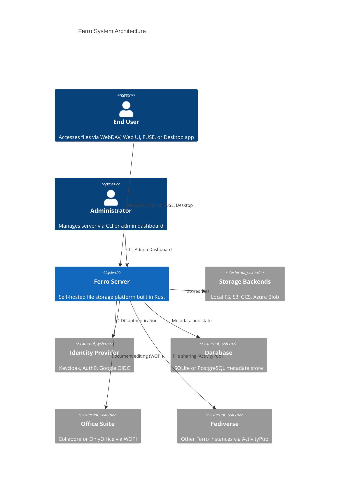
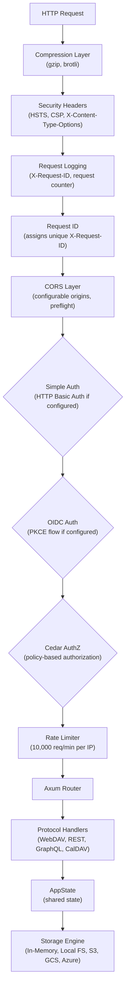
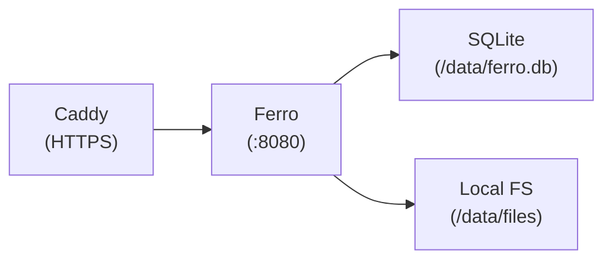
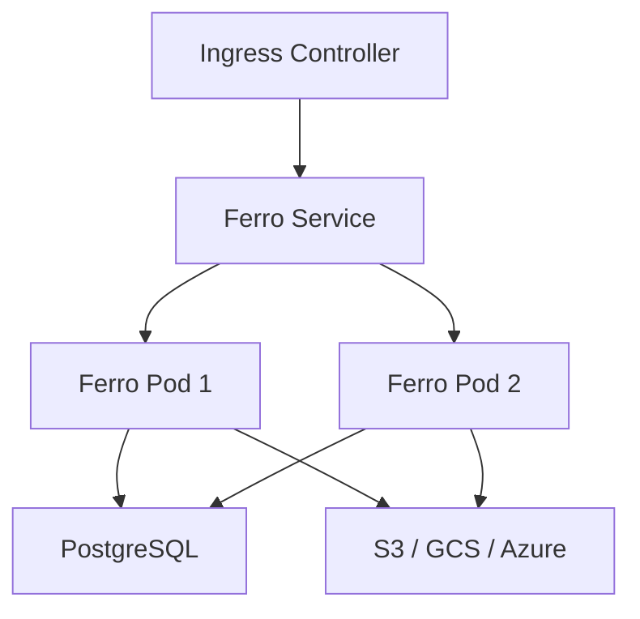
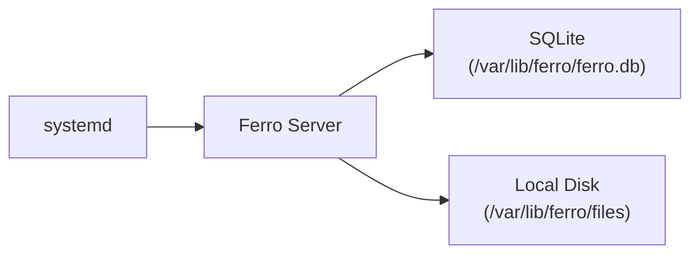

## System Architecture



## Crate Structure

Ferro is built as a Rust workspace with 73 crates organized by functional domain.

### Client & UI

| Crate | Purpose |
|-------|---------|
| `ferro-web` | Leptos WASM web frontend for file browsing and upload |
| `ferro-desktop` | Tauri desktop application with file browser and FUSE integration |
| `ferro-cli` | Admin CLI tool for server management |
| `ferro-client` | Async WebDAV client with optional C-FFI bindings for mobile (Swift/Kotlin) |
| `ferro-fuse` | FUSE3 filesystem mount translating POSIX operations to WebDAV HTTP requests |

### Server

| Crate | Purpose |
|-------|---------|
| `ferro-server` | Axum web server with all HTTP handlers: WebDAV, REST, GraphQL, WebSocket |
| `ferro-webdav-handler` | WebDAV XML builders and PROPFIND/PROPPATCH response generation |
| `ferro-admin` | Leptos admin dashboard for server management |
| `ferro-graphql` | GraphQL API built with async-graphql |
| `ferro-server-webdav` | WebDAV-specific server logic and route handlers |

### Auth & Security

| Crate | Purpose |
|-------|---------|
| `ferro-auth` | OIDC (PKCE), Cedar authorization, and simple HTTP Basic auth |
| `ferro-crypto` | `CryptoProvider` trait with Ring-based implementation: SHA-256/512, HMAC, bcrypt |
| `ferro-server-security` | Security middleware: headers, CORS, input validation |
| `ferro-rate-limiter` | Per-IP token-bucket rate limiter (10,000 req/min) |

### Core Services

| Crate | Purpose |
|-------|---------|
| `ferro-common` | Foundation types: `StorageEngine` trait, `FileMetadata`, `FerroError`, path utilities |
| `ferro-core` | Storage backends (SQLite, PostgreSQL, S3, GCS, Azure), Tantivy search, Wasmtime WASM runtime |
| `ferro-dav` | iCalendar (RFC 5545) and vCard (RFC 6350) parsers, CalDAV/CardDAV store traits |
| `ferro-observability` | Metrics (Prometheus), health checks, request logging |
| `ferro-health` | Liveness, readiness, and startup probes |

### Extensions

| Crate | Purpose |
|-------|---------|
| `ferro-crdt` | CRDT-based text co-editing for real-time collaboration |
| `ferro-cache` | In-memory cache layer for frequently accessed files |
| `ferro-event-bus` | Internal event system for decoupled component communication |
| `ferro-audit-log` | Tamper-evident audit trail with SHA-256 hash chain |
| `ferro-webhook` | Outbound webhook dispatch for file events |
| `ferro-wasm-host` | WASM plugin hosting and sandboxing (Wasmtime) |

### Federation & Distributed

| Crate | Purpose |
|-------|---------|
| `ferro-server-activitypub` | ActivityPub federation for cross-instance file sharing |
| `ferro-server-webrtc` | WebRTC signaling for peer-to-peer connections |
| `ferro-server-wopi` | WOPI protocol for online document editing (Collabora/OnlyOffice) |
| `ferro-server-versioning` | File versioning with diff support |
| `ferro-distributed` | Raft consensus and erasure coding for multi-node deployments |
| `ferro-sync-protocol` | Sync protocol for client-server delta synchronization |

### Platform & Scaling

| Crate | Purpose |
|-------|---------|
| `ferro-multi-tenant` | Tenant isolation for multi-user deployments |
| `ferro-offline` | Offline mode with local cache and sync |
| `ferro-selective-sync` | Selective folder sync for bandwidth optimization |
| `ferro-mount-nfs` | NFS/SMB mount trait for network filesystem integration |
| `ferro-ai` | Semantic search and auto-tagging |
| `ferro-backend-router` | Backend routing and load balancing across storage engines |
| `ferro-consistent-hash` | Consistent hashing for distributed storage routing |
| `ferro-migrate` | Data migration between Ferro instances or storage backends |

### Tooling

| Crate | Purpose |
|-------|---------|
| `ferro-benchmarks` | Criterion benchmarks for performance regression testing |

## Request Flow

How a WebDAV request flows through the system:



Each middleware layer can short-circuit the request (e.g., rate limiter returns 429, auth returns 401). The middleware stack processes requests in order.

## Storage Architecture

### Content-Addressable Storage (CAS)

When `--data-dir` is set, Ferro enables CAS deduplication:

1. File content is hashed with SHA-256
2. The hash becomes the storage key
3. Duplicate content is stored once, referenced by hash
4. Metadata tracks which paths reference each content block
5. Reference counting enables safe deletion

### Metadata Store

Ferro supports two metadata backends:

| Backend | Use Case | Features |
|---------|----------|----------|
| SQLite | Single-node, default | WAL mode, bundled, zero-config |
| PostgreSQL | Multi-node, production | Connection pooling, read replicas |

Metadata includes: file paths, sizes, MIME types, content hashes, owner, timestamps, versions, and share links.

### Storage Abstraction

All storage operations go through the `StorageEngine` trait in `ferro-common`:

```rust
pub trait StorageEngine: Send + Sync {
    async fn head(&self, path: &str) -> Result<FileMetadata>;
    async fn get(&self, path: &str) -> Result<Bytes>;
    async fn get_stream(&self, path: &str) -> Result<StorageReader>;
    async fn put(&self, path: &str, content: Bytes, owner: &str) -> Result<FileMetadata>;
    async fn delete(&self, path: &str) -> Result<()>;
    async fn list(&self, path: &str) -> Result<Vec<FileMetadata>>;
    async fn copy(&self, from: &str, to: &str) -> Result<()>;
    async fn move_path(&self, from: &str, to: &str) -> Result<()>;
    async fn exists(&self, path: &str) -> Result<bool>;
    async fn create_collection(&self, path: &str, owner: &str) -> Result<FileMetadata>;
    async fn list_all(&self, path: &str, max_depth: u32) -> Result<Vec<FileMetadata>>;
    async fn put_multipart(&self, path: &str, parts: Vec<Bytes>, owner: &str) -> Result<FileMetadata>;
}
```

This allows swapping backends without changing server code. The `ObjectStoreStorageEngine` in `ferro-core` wraps the `object_store` crate to support S3, GCS, and Azure via a single implementation.

## Sync Architecture

### Client-Server Sync

Ferro supports incremental synchronization via sync tokens and delta queries:

1. **Sync Token**: Each PROPFIND response includes a `sync-token` representing the current state
2. **Delta Query**: Clients request changes since a given sync token via `/api/sync/delta?since=<clock>`
3. **SSE Events**: Real-time file-change events streamed via `/api/sync/events`
4. **WebSocket**: Push notifications for file operations via `/api/ws`

### Selective Sync

The `ferro-selective-sync` crate enables bandwidth optimization by allowing clients to sync only specific folders or file types.

### Offline Mode

The `ferro-offline` crate provides local caching and automatic sync when connectivity is restored, using the delta protocol to transfer only changed blocks.

## Security Architecture

### Authentication

| Method | Description |
|--------|-------------|
| Simple Auth | HTTP Basic Auth with bcrypt-hashed passwords (cost factor 12) |
| OIDC | OpenID Connect with PKCE flow (Keycloak, Auth0, Google) |
| LDAP | LDAP authentication (behind `ldap` feature flag) |

### Authorization

Cedar policy engine provides fine-grained access control:

```
permit(
  principal == User::"alice",
  action == Action::"read",
  resource in Folder::"documents"
);
```

### Encryption

| Layer | Implementation |
|-------|---------------|
| Transport | TLS 1.3 (via reverse proxy) |
| File E2E | age (X25519, ChaCha20-Poly1305) |
| Passwords | bcrypt (cost factor 12) |
| Tokens | HMAC-SHA256 |
| Comparison | Constant-time for secrets |

### Audit Logging

All file operations are tracked in a tamper-evident audit log. Each entry's `chain_hash` contains `SHA-256(previous_chain_hash || timestamp || method || path || user || status || client_ip)`, making retroactive modification detectable.

## Deployment Architecture

### Docker



### Kubernetes



### Bare Metal



### Scaling Guide

| Users | Recommended Setup |
|-------|-------------------|
| 1-10 | Single node, local storage, SQLite |
| 10-100 | Single node, local storage, PostgreSQL |
| 100-1000 | Multiple nodes behind load balancer, shared PostgreSQL + S3 |
| 1000+ | Kubernetes with HPA, PostgreSQL HA, S3 |

## Feature Flags

| Flag | Crate | Description |
|------|-------|-------------|
| `s3` | server, core | Amazon S3 storage backend |
| `gcs` | server, core | Google Cloud Storage backend |
| `azure` | server, core | Azure Blob Storage backend |
| `sqlite` | core | SQLite metadata store (default) |
| `search` | core | Tantivy full-text search (default) |
| `wasm` | core | Wasmtime WASM worker runtime |
| `object_store` | core | object_store backend (default) |
| `pg` | server | PostgreSQL metadata and state |
| `redis` | server | Redis distributed locking and rate limiting |
| `ldap` | server | LDAP authentication |
| `handlers` | dav | Axum handlers for CalDAV/CardDAV (default) |
| `persistence` | dav | SQLite persistence for calendar/address book stores |
| `ffi` | client | C-compatible FFI bindings for mobile |
| `ring` | crypto | Ring-based CryptoProvider (default) |
| `fips` | crypto | FIPS-approved mode (implies `ring`) |

```bash
# Build with all storage backends
cargo build --features s3,gcs,azure

# Build with PostgreSQL and Redis
cargo build --features pg,redis
```
