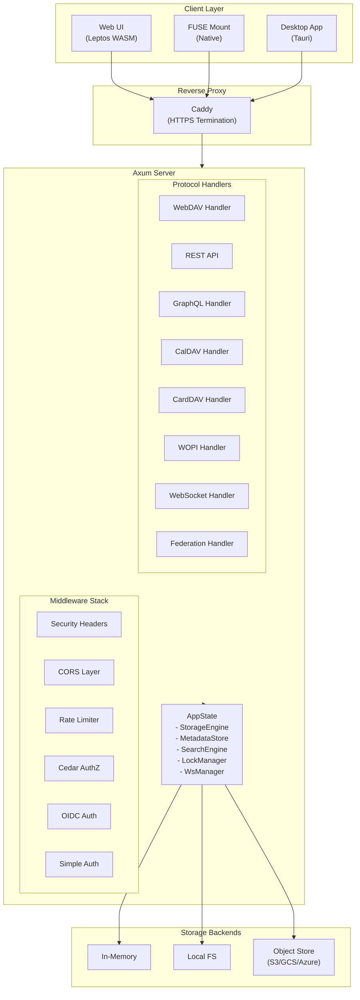

# Introduction

## What is Ferro?

Ferro is a high-performance, self-hosted file storage platform built entirely in Rust. It provides WebDAV-compatible file access, content-addressable storage with deduplication, OIDC authentication, full-text search, WASM-based file processing, and WOPI protocol support for online document editing.

Ferro is a storage orchestrator -- it sits between your files and the storage backends, providing a unified API for accessing, searching, sharing, and processing files regardless of where they are stored.

## Key Features

- **WebDAV Server** -- Full Class 1/2/3 compliance (PROPFIND, MKCOL, PUT, GET, DELETE, COPY, MOVE, LOCK, UNLOCK, PROPPATCH)
- **Multiple Storage Backends** -- In-memory, local filesystem, S3, GCS, Azure Blob Storage
- **Content-Addressable Storage** -- SHA-256 deduplication, saves space automatically
- **OIDC Authentication** -- PKCE login flow with Keycloak, Auth0, Google, etc.
- **Cedar Authorization** -- Fine-grained policy-based access control
- **Full-Text Search** -- Tantivy-powered search with auto-indexing
- **WASM Workers** -- Run custom file processing pipelines (resize, convert, transform)
- **WOPI Protocol** -- Online document editing via Collabora/OnlyOffice
- **CalDAV / CardDAV** -- Calendar and address book access (RFC 5545, RFC 6350)
- **ActivityPub Federation** -- Share files across Ferro instances using the fediverse
- **Share Links** -- Public file sharing with optional passwords and expiration
- **Audit Logging** -- Track all file operations
- **Metadata Snapshots** -- Point-in-time recovery for ransomware protection
- **File Versioning** -- Keep multiple versions per file with diff support
- **Rate Limiting** -- Per-IP token-bucket rate limiter (10,000 req/min)
- **Web UI** -- Modern Leptos-based file browser with drag-and-drop upload
- **Admin CLI** -- Full command-line management tool
- **FUSE Mount** -- Access remote files as a local directory on Linux
- **Desktop App** -- Tauri desktop application for file browsing
- **E2E Encryption** -- age-based file encryption (X25519, ChaCha20-Poly1305)

## Comparison with Nextcloud / OCIS

| Feature | Ferro | Nextcloud | OCIS |
|---------|-------|-----------|------|
| Language | Rust (application code; depends on SQLite, OpenSSL for PG) | PHP / Go | Go |
| WebDAV | Class 1/2/3 | Class 1/2/3 | Class 1/2/3 |
| CalDAV/CardDAV | Yes | Yes | Yes |
| Federation | ActivityPub | Nextcloud Federation | No |
| Storage Backends | Memory, FS, S3, GCS, Azure | FS, S3, SMB | FS, S3, Azure |
| CAS Deduplication | SHA-256 | No | No |
| WASM Workers | Yes | No | No |
| OIDC Auth | Yes | Yes | Yes |
| Cedar AuthZ | Yes | RBAC | RBAC |
| FUSE Mount | Native | External | No |
| Desktop App | Tauri | GTK/Qt | No |
| Binary Size | ~15 MB (stripped release, default features) | ~200+ MB | ~80 MB |

## Architecture Overview

## License

Ferro is licensed under [AGPL-3.0-or-later](https://www.gnu.org/licenses/agpl-3.0.en.html).
